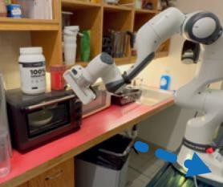
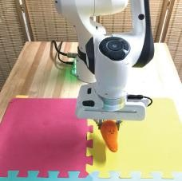

# Aligning Cyber Space with Physical World: A Comprehensive Survey on Embodied AI

> Yang Liu, Weixing Chen, Yongjie Bai, Guanbin Li, Wen Gao, _Fellow, IEEE, Liang Lin, Fellow, IEEE_

_Abstract_---Embodied Artificial Intelligence (Embodied AI) is crucial for achieving Artificial General Intelligence (AGI) and serves as a foundation for various applications that bridge cyberspace and the physical world. Recently, the emergence of Multi-modal Large Models (MLMs) and World Models (WMs) have attracted significant attention due to their remarkable perception, interaction, and reasoning capabilities, making them a promising architecture for the brain of embodied agents. However, there is no comprehensive survey for Embodied AI in the era of MLMs. In this survey, we give a comprehensive exploration of the latest advancements in Embodied AI. Our analysis firstly navigates through the forefront of representative works of embodied robots and simulators, to fully understand the research focuses and their limitations. Then, we analyze four main research targets: 1) embodied perception, 2) embodied

**Multimodal Embodied Robot** {width="4.115594925634296e-2in" height="4.115594925634296e-2in"}
**Multimodal Embodied AI Multimodal Embodied Perception** {width="4.115594925634296e-2in" height="4.115594925634296e-2in"}
**Multimodal Embodied Manipulation Multimodal Embodied Planning** {width="4.115594925634296e-2in" height="4.174431321084864e-2in"}
**Multimodal Embodied Agent**

interaction, 3) embodied agent, and 4) sim-to-real adaptation, covering the state-of-the-art methods, essential paradigms, and comprehensive datasets. Additionally, we explore the complexities of MLMs in virtual and real embodied agents, highlighting their significance in facilitating interactions in dynamic digital and physical environments. Finally, we summarize the challenges and limitations of embodied AI and discuss their potential future directions. We hope this survey will serve as a foundational reference for the research community and inspire continued innovation. The associated project can be found at [https://github.](https://github.com/HCPLab-SYSU/Embodied_AI_Paper_List) [com/HCPLab-SYSU/Embodied AI Paper List.](https://github.com/HCPLab-SYSU/Embodied_AI_Paper_List)

**_Index Terms_---Embodied AI, Cyber Space, Physical World, Multi-modal Large Models, World Models, Agents, Robotics**

I. INTRODUCTION

Fig. 1. []{#\_bookmark1 .anchor}Google Scholar results for topics of Embodied AI. The vertical and horizontal axes denote the number of publications and the year, respectively. The publications grow exponentially since the breakthrough of MLMs in 2023.

MBODIED AI was initially proposed from the Embod­ied Turing Test by Alan Turing in 1950 [[1],](#_bookmark25) which is designed to determine whether agents can display intelligence that is not just limited to solving abstract problems in a virtual environment (cyber space[^1^](#_bookmark0)), but that is also capable of navigating the complexity and unpredictability of the physical world. The agents in the cyber space are generally referred to as disembodied AI, while those in the physical space are embodied AI (Table [I).](#_bookmark2) Recent advances in Multi-modal Large Models (MLMs) have injected strong perception, interaction and planning capabilities to embodied models, to develop general-purpose embodied agents and robots that actively interact with virtual and physical environments [[2]](#\_bookmark26) Therefore, the embodied agents are widely considered as the best carriers for MLMs. The recent representative embodied models are RT-2 [[3]](#\_bookmark27) and RT-H [[4]](#\_bookmark28) Nevertheless, the capabilities of long-term memory, understanding complex intentions, and the decomposition of complex tasks are limited for current MLMs. To achieve Artificial General Intelligence (AGI), the de­velopment of embodied AI stands as a fundamental avenue. Different from conversational agents like ChatGPT [[5],](#_bookmark29) em­bodied AI believes that the true AGI can be achieved by controlling physical embodiments and interacting with both simulated and physical environments [[6]--[8]](#\_bookmark31) As we stand at the forefront of AGI-driven innovation, it is crucial to delve deeper into the realm of embodied AI, unraveling their complexities, evaluating their current developmental stage, and contemplating the potential trajectories they may follow in the future. Nowadays, embodied AI contains various key techniques across Computer Vision (CV), Natural Language Processing (NLP), and robotics, with the most representative being embodied perception, embodied interaction, embodied agents, and sim-to-real robotic control. Therefore, it is imper­ative to capture the evolving landscape of embodied AI in the pursuit of AGI through a comprehensive survey.

Embodied agent is the most prominent basis of embodied AI. For an embodied task, the embodied agent must fully un­derstand the human intention in language instructions, actively

[]{#\_bookmark2 .anchor}TABLE I

[Comparison between disembodied AI and embodied AI.]{.smallcaps}

+------------------+------------------+-----------------------------+--------------------------------------------------+---------------------------------------------------------------------------------------+
| Type | Environment | Physical Entities | Description | Representative Agents |
+==================+==================+=============================+==================================================+=======================================================================================+
| Disembodied AI | Cyber Space | No | Cognition and physical entities are disentangled | ChatGPT [[9],](#_bookmark32) RoboGPT [[10]](#\_bookmark33) |
| | | | | |
| Embodied AI | Physical Space | Robots, Cars, Other devices | Cognition is integrated into physical entities | RT-1 [[11],](#_bookmark34) RT-2 [[3],](#_bookmark27) RT-H [[4]](#\_bookmark28) |
+------------------+------------------+-----------------------------+--------------------------------------------------+---------------------------------------------------------------------------------------+

{width="0.9637740594925635in" height="0.9967432195975503in"}
{width="0.16383748906386703in" height="0.16528543307086613in"}
{width="0.13126859142607175in" height="0.15070100612423448in"}
{width="2.0912150043744533in" height="1.5859962817147857in"}
{width="0.11344160104986876in" height="0.15313210848643918in"}
{width="0.11807195975503063in" height="0.25493000874890637in"}
{width="0.25101924759405075in" height="0.1122736220472441in"}
{width="0.6098097112860892in" height="0.3909897200349956in"}
{width="1.038639545056868in" height="0.38543416447944007in"}
{width="0.6230052493438321in" height="0.3861286089238845in"}
{width="1.1702088801399826in" height="1.0970997375328084in"}
{width="0.48409667541557305in" height="0.4319641294838145in"}
{width="0.232671697287839in" height="0.19306430446194225in"}
{width="0.4847911198600175in" height="0.2819575678040245in"}
{width="0.4868755468066492in" height="0.2791797900262467in"}
{width="0.3041524496937883in" height="0.19584208223972002in"}
{width="0.6424529746281715in" height="0.426408573928259in"}
{width="0.48409667541557305in" height="0.4104352580927384in"}
{width="0.6389807524059492in" height="0.4090463692038495in"}
{width="0.30629374453193353in" height="0.22223206474190726in"}
{width="0.19030511811023623in" height="0.27292869641294837in"}
{width="0.13126859142607175in" height="0.16250765529308836in"}
{width="0.3236570428696413in" height="0.33473753280839896in"}
{width="9.445756780402449e-2in" height="0.12708880139982504in"}
{width="0.49312554680664916in" height="0.3333486439195101in"}
{width="1.232121609798775in" height="0.8042038495188102in"}

**Brain: Embodied World Model**

Fig. 2. []{#\_bookmark3 .anchor}The overall framework of the embodied agent based on MLMs and WMs. The embodied agent has a embodied world model as its "brain". It has the capability to understand the virtual-physical environment and actively perceive multi-modal elements. It can fully understand human intention, align with human value and event causality, decompose complex tasks, and execute reliable actions, as well as interact with humans and utilize knowledge and tools.

explore the surrounding environments, comprehensively per­ceive the multi-modal elements from both virtual and physical environments, and execute appropriate actions for complex tasks [[12],](#_bookmark35) [[13],](#_bookmark36) as shown in Fig. [2.](#_bookmark3) The rapid progress in multi-modal models exhibits superior versatility, dexterity, and generalizability in complex environments compared to tra­ditional deep reinforcement learning approaches. Pre-trained visual representations from state-of-the-art vision encoders [[14],](#_bookmark37) [[15]](#\_bookmark38) provide precise estimations of object class, pose, and geometry, which makes the embodied models thoroughly perceive complex and dynamic environments. Powerful Large Language Models (LLMs) make robots better understand the linguistic instructions from humans. Promising MLMs gives feasible approach for aligning the visual and linguistic representations from embodied robots. The world models [[16],](#_bookmark39) [[17]](#\_bookmark40) exhibit remarkable simulation capabilities and promis­ing comprehension of physical laws, which makes embodied models comprehensively understand both the physical and real environments. These innovations empower embodied agents to comprehensively perceive complex environment, interact with humans naturally, and execute tasks reliably.

The advancement of embodied AI has exhibited rapid progress, capturing significant attention within the research community (Fig. [1),](#_bookmark1) and it is recognized as the most feasible path for achieving AGI. Google Scholar reports a substantial volume of embodied AI publications, with approximately 10,700 papers published in 2023 alone. This accounts for an average of 29 papers per day or more than one paper per hour. Despite the intensive interest in harvesting the powerful perception and reasoning ability from MLMs, the research community is short of a comprehensive survey that can help sort out existing embodied AI studies, the facing challenges, as well as future research directions. In the era of MLMs, we aim to fill up this gap by performing a systematic survey of embodied AI across cyber space to physical world. We conduct the survey from different perspectives including embodied robots, simulators, four representative embodied tasks (visual active perception, embodied interaction, multi-modal agents and sim-to-real robotic controlling), and future research directions. We believe that this survey will provide a clear big picture of what we have achieved, and we could further achieve along this emerging yet very prospective research direction.

**Differences from previous works**: Although there have been several survey papers [[6],](#_bookmark30) [[18]--[20]](#\_bookmark42) for embodied AI, most of them are outdated as they were published before the era of MLMs, which started around 2023. To the best of our knowledge, there is only one survey paper [[8]](#\_bookmark31) after 2023, which only focused on vision-language-action embodied AI models. However, the MLMs, WMs and embodied agents are not fully considered. Additionally, recent developments in embodied robots and simulators are also overlooked. To address the scarcity of comprehensive survey papers in this rapidly developing field, we propose this comprehensive sur­vey that covers representative embodied robots, simulators, and four main research tasks: embodied perception, embodied interaction, embodied agents, and sim-to-real robotic control.

In summary, the main contributions of this work are three­fold. First, it presents a systematic review of embodied AI including embodied robots, simulators, and four main research tasks: visual active perception, embodied interaction,embodied agents and sim-to-real robotic control. To the best of our knowledge, this is the first comprehensive survey of embodied AI from the perspective of the alignment of cyber and physical spaces based on MLMs and WMs, offering a broad overview with a thorough summary and categorization of existing studies. Second, it examines the latest progress in embodied AI, providing comprehensive benchmarking and discussion of current work across multiple simulators and datasets. Third, it

{width="7.038464566929134in" height="2.3200010936132984in"}

Fig. 3. This survey focuses on comprehensive analysis of the latest advancements in embodied AI.
(a) Fixed-base Robots (Franka Emika Panda)
(b) Wheeled Robots

{width="0.5630719597550307in" height="0.6342661854768153in"}
{width="0.8998490813648294in" height="1.3633213035870517in"}
{width="0.5956310148731409in" height="0.5249628171478565in"}
{width="0.7043919510061243in" height="0.7043930446194225in"}
{width="0.6507644356955381in" height="0.2956288276465442in"}
{width="0.6507644356955381in" height="0.3020559930008749in"}
{width="0.5634339457567804in" height="0.4497036307961505in"}

(Jackal robot)

(d) Quadruped Robots (Boston Dynamics Spot)
(c) Tracked Robots (iRobot PackBot)

{width="0.5811340769903762in" height="0.5859372265966755in"}

(e) Humanoid Robots (Tesla Optimus)

    A.  *Fixed-base Robots*

Fixed-base robots, as shown in Fig. [4](#_bookmark4) (a), are extensively employed in laboratory automation, educational training, and industrial manufacturing due to their compactness and high-precision operations. These robots feature robust bases and structures that ensure stability and high accuracy during opera­tion. Equipped with high-precision sensors and actuators, they achieve micron-level precision, making them suitable for tasks that require high accuracy and repeatability [[21]](#\_bookmark43) Moreover, fixed-base robots are highly programmable, allowing users to identifies several research challenges and potential directions for future research in AGI for embodied AI.

(f) {width="0.465in" height="1.201680883639545in"}Biomimetic Robots

Fig. 4. []{#\_bookmark4 .anchor}The Embodied Robots include Fixed-base Robots, Quadruped Robots, Humanoid Robots, Wheeled Robots, Tracked Robots, and Biomimetic Robots.

The rest of this survey is organized as follows. Section 2 introduces various embodied robots. Section 3 describes gen­eral and real-scene embodied simulators. Section 4 introduces embodied perception, including active visual perception, 3D visual grounding, visual language navigation and non-visual perception. Section 5 introduces embodied interaction. Section 6 introduces embodied agents including the embodied multi­modal foundation model and embodied task planning. Section 7 introduces sim-to-real adaptation including embodied world model, data collection and training, and embodied control. In Section 8, we discuss promising research directions.

## II. EMBODIED ROBOTS

Embodied agent actively interacts with the physical envi­ronment and encompasses a broad spectrum of embodiments, including robots, smart appliances, smart glasses, autonomous vehicles, etc. Among them, robots stand out as one of the most prominent embodiments. Depending on the applications, robots are designed in various forms to leverage their hardware characteristics for specific tasks, as shown in Fig. [4.](#_bookmark4)

adapt them for various task scenarios, such as Franka (Franka Emika panda) [[22],](#_bookmark44) Kuka iiwa (KUKA) [[23],](#_bookmark45) and Sawyer (Rethink Robotics) [[24]](#\_bookmark46) Nevertheless, fixed-base robots have certain disadvantages. Their fixed-base design limits their operational range and flexibility, preventing them from moving or adjusting positions over large areas and leading to their collaboration with humans and other robots. [[21]](#\_bookmark43)

B. _Wheeled Robots and Tracked Robots_

For mobile robots, they can face more complex and diverse application scenarios. Wheeled robots, as shown in Fig. [4](#_bookmark4) (b), known for their efficient mobility, are widely employed in lo­gistics, warehousing, and security inspections. The advantages of wheeled robots include their simple structure, relatively low cost, high energy efficiency, and rapid movement capabilities on flat surfaces [[21]](#\_bookmark43) These robots are typically equipped with high-precision sensors such as LiDAR and cameras, enabling autonomous navigation and environmental perception, making them highly effective in automated warehouse management and inspection tasks, e.g., Kiva robots (Kiva Systems) [[25]](#\_bookmark47) and Jackal robot (Clearpath Robotics) [[26]](#\_bookmark48) However, wheeled robots have limited mobility in complex terrains and harsh en­vironments, particularly on uneven ground. Additionally, their load capacity and maneuverability are somewhat restricted.

Differently, tracked robots have powerful off-road capabil­ities and maneuverability, showing potential in agriculture, construction, and disaster recovery, as shown in Fig. [4](#_bookmark4) (c). The track system provides a larger ground contact area, distributing the robot's weight and reducing the risk of sinking in soft terrain such as mud and sand. Moreover, tracked robots are equipped with robust power and suspension systems, to maintain stability and traction on complex terrains [[27]](#\_bookmark49) Con­sequently, tracked robots are also used in sensitive areas such as the military. The iRobot's PackBot is a versatile military-tracked robot capable of performing tasks such as reconnais­sance, explosive ordnance disposal, and rescue missions [[28]](#\_bookmark50) However, due to the high friction of the track system, tracked robots often suffer from low energy efficiency. Additionally, their movement speed on flat surfaces is slower than wheeled robots, as well as their flexibility and maneuverability.

C. _Quadruped Robots_

Quadruped robots, known for their stability and adaptabil­ity, are well-suited for complex terrain exploration, rescue missions, and military applications. Inspired by quadrupedal animals, these robots can maintain balance and mobility on uneven surfaces, as shown in Fig. [4](#_bookmark4) (d). The multi-jointed design allows them to mimic biological movements, achieving complex gaits and posture adjustments. High adjustability enables the robots to automatically adapt their stance to chang­ing terrain, enhancing maneuverability and stability. Sensing systems, such as LiDAR and cameras, provide environmental awareness, allowing the robots to navigate autonomously and avoid obstacles [[29]](#\_bookmark51) Several types of quadruped robots are widely used: Unitree Robotics, Boston Dynamics Spot, and ANYmal C. Unitree Robotics' Unitree A1 and Go1 are noted for their cost-effectiveness and flexibility. The A1 [[30]](#\_bookmark52) and Go1 [[31]](#\_bookmark53) possess strong mobility and intelligent obsta­cle avoidance capabilities, suitable for various applications. Boston Dynamics' Spot is renowned for its superior stability and operational flexibility, which are commonly used in in­dustrial inspections and rescue missions. It features powerful load-carrying capacity and adaptability, capable of perform­ing complex tasks in harsh environments [[32]](#\_bookmark54) ANYbotics' ANYmal C, with its modular design and high durability, is widely employed in industrial inspection and maintenance. The ANYmal C is equipped with autonomous navigation and remote operation capabilities, suitable for prolonged outdoor tasks and even extreme lunar missions [[33]](#\_bookmark55) The complex design and high manufacturing costs of quadruped robots result in substantial initial investments, limiting their use in cost-sensitive areas. Additionally, they have limited battery en­durance in complex environments, requiring frequent recharg­ing or battery replacement for prolonged operation [[34]](#\_bookmark56)

D. _Humanoid Robots_

Humanoid robots are distinguished by their human-like form and are increasingly prevalent in sectors such as the service industry, healthcare, and collaborative environments. These robots can mimic human movements and behavioral patterns, providing personalized services and support. Their dexterous hand designs enable them to perform intricate and complex tasks, distinguishing them from other types of robots, as shown in Fig. [4](#_bookmark4) (e). These hands typically have multiple de­grees of freedom and high-precision sensors, allowing them to emulate the grasping and manipulation capabilities of human hands, which is particularly crucial in fields such as medical surgery and precision manufacturing [[35]](#\_bookmark57) Among current humanoid robots, Atlas (Boston Dynamics) is renowned for its exceptional mobility and stability. Atlas can perform com­plex dynamic actions such as running, jumping, and rolling, demonstrating the potential of humanoid robots in highly dynamic environments [[36]](#\_bookmark58) The HRP series (AIST) is utilized in various research and industrial applications, with a design focus on high stability and flexibility, making it effective in complex environments, particularly for collaborative tasks with humans [[37]](#\_bookmark59) ASIMO (Honda), one of the most famous humanoid robots, can walk, run, climb stairs, and recognize faces and gestures, making it suitable for reception and guide services [[38]](#\_bookmark60) Additionally, a small social robot, Pepper (Soft-bank Robotics) can recognize emotions and engage in natural language communication and is widely used in customer service and educational settings [[39]](#\_bookmark61)

Nevertheless, humanoid robots face challenges in main­taining operational stability and reliability in complex envi­ronments due to their sophisticated control systems. These challenges include robust bipedal walking control and dex­terous hand grasping [[40].Furthermore,](#_bookmark62) traditional humanoid robots based on hydraulic systems, characterized by their bulky structures and high maintenance costs, are increasingly being replaced by motor-driven systems. Recently, Tesla and Unitree Robotics have introduced their humanoid robots based on motor systems. With the integration of LLMs, humanoid robots are expected to handle various complex tasks intelli­gently, filling labor gaps in manufacturing, healthcare, and the service industry, thereby improving efficiency and safety [[41]](#\_bookmark63)

E. _Biomimetic Robots_

Differently, biomimetic robots perform tasks in complex and dynamic environments by simulating efficient movements and functions of natural organisms. By emulating biologi­cal entities' forms and movement mechanisms, these robots demonstrate significant potential in fields such as healthcare, environmental monitoring, and biological research [[21]](#\_bookmark43) Typ­ically, they utilize flexible materials and structures to achieve lifelike, agile movements and minimize environmental impact. Importantly, biomimetic designs can significantly improve the robots' energy efficiency by mimicking the efficient move­ment mechanisms of biological organisms, making them more economical regarding energy consumption [[42],](#_bookmark64) [[43]](#\_bookmark65) These biomimetic robots include fish-like robots [[44],](#_bookmark66) [[45],](#_bookmark67) insect-like robots [[46],](#_bookmark68) [[47],](#_bookmark69) and soft-bodied robots [[48],](#_bookmark70) as shown in Fig. [4](#_bookmark4) (f). However, biomimetic robots face several challenges. First, their design and manufacturing processes are complex and costly, limiting large-scale production and widespread application. Second, due to their use of flexible materials and complex movement mechanisms, the durability and reliability of biomimetic robots are limited in extreme environments.

## III. EMBODIED SIMULATORS

Embodied simulators are vital for embodied AI as they offer cost-effective experimentation, ensuring safety by simulating potentially hazardous scenarios, scalability for testing in di­verse environments, rapid prototyping capabilities, accessibil­ity to a wider research community, controlled environments for precise studies, data generation for training and evaluation, and standardized benchmarks for algorithm comparison. To enable agents to interact with the environment, it is necessary to construct a realistic simulated environment. This requires consideration of the physical characteristics of the environ­ment, the properties of objects, and their interactions.

This section will introduce the commonly used simulation platforms in two parts: the general simulator based on under­lying simulation and the simulator based on real scenes.

[]{#\_bookmark5 .anchor}TABLE II

[General Simulator.]{.smallcaps} **HFPS**[: high-fidelity physical simulation;]{.smallcaps} **HQGR**[: high-quality graphics rendering;]{.smallcaps} **RRL**[: rich robot library;]{.smallcaps}

**DLS**[: deep learning support;]{.smallcaps} **LSPC**[: large-scale parallel computing;]{.smallcaps} **ROS**[: tight integration with ROS;]{.smallcaps} **MSS**[: multiple sensor]{.smallcaps}

SIMULATION; **CP**: CROSS-PLATFORM **NAV**: ROBOT NAVIGATION **AD**: AUTO DRIVING; **RL**: REINFORCEMENT LEARNING **LSPS**: LARGE-SCALE PARALLEL SIM **MR**: MULTI-ROBOT SYSTEMS **RS**: ROBOT SIMULATION. _◦_ INDICATES THAT THE SIMULATOR EXCELS AT THIS ASPECT.

Simulator Year **HFPS HQGR RRL DLS LSPC ROS MSS CP** Physics Engine Main Applications Isaac Sim [[49]](#*bookmark71) 2023 *○ ○ ○ ○ ○ ○ ○ ○\_ PhysX Nav, AD

Isaac Gym [[50]](#\_bookmark72) 2019
PhysX RL,LSPS Gazebo [[51]](#\_bookmark73) 2004
ODE, Bullet, Simbody, DART Nav,MR PyBullet [[52]](#\_bookmark74) 2017
Bullet RL,RS Webots [[53]](#\_bookmark75) 1996
ODE RS MuJoCo [[54]](#\_bookmark76) 2012
Custom RL, RS
Unity ML-Agents [[55]](#\_bookmark77) 2017 、
Custom RL, RS
AirSim [[56]](#\_bookmark78) 2017
Custom Drone sim, AD, RL MORSE [[57]](#\_bookmark79) 2015
Bullet Nav, MR
CoppeliaSim (V-REP) [[58]](#\_bookmark80) 2013
Bullet, ODE, Vortex, Newton MR, RS

{width="0.8177263779527559in" height="0.46002734033245846in"}
{width="0.8172736220472441in" height="0.4577635608048994in"}
{width="0.8580238407699038in" height="0.46002734033245846in"}
{width="0.831761811023622in" height="0.4554997812773403in"}

Isaac Sim
Gazebo
Pybullet
CoppeliaSim (V-REP)

{width="0.4523293963254593in" height="0.4582163167104112in"}
{width="0.5456036745406824in" height="0.4278794838145232in"}
{width="0.5225109361329834in" height="0.4219936570428696in"}
{width="0.7384886264216973in" height="0.4219936570428696in"}
{width="0.5628083989501312in" height="0.4219936570428696in"}
{width="3.3334525371828523in" height="0.6169717847769028in"}AI2-THOR

Matterport 3D
Virtualhome
SAPIEN

{width="0.9346205161854768in" height="0.5944728783902012in"}
{width="0.971823053368329in" height="0.5959503499562555in"}
{width="1.01748687664042in" height="0.5986439195100612in"}MuJoCo Unity ML-Agents AirSim MORSE Webots

Fig. 5. []{#\_bookmark6 .anchor}Examples of General Simulators. The MuJoCo's figure is from [[59]](#\_bookmark81)

A. _General Simulator_

The physical interactions and dynamic changes present in real environments are irreplaceable. However, deploying embodied models in the physical world often incurs high costs and faces numerous challenges. General-purpose simulators provide a virtual environment that closely mimics the physical world, allowing for algorithm development and model training, which offers significant cost, time, and safety advantages.

**Isaac Sim** [[49]](#\_bookmark71) is an advanced simulation platform for robotics and AI research. It has high-fidelity physical sim­ulation, real-time ray tracing, an extensive library of robotic models, and deep learning support. Its application scenarios in­clude autonomous driving, industrial automation, and human-robot interaction.**Gazebo** [[60]](#\_bookmark82) is an open-source simulator for robotics research. It has extensive robot libraries, and tight integration with ROS. It supports the simulation of various sensors and offers numerous pre-built robot models and envi­ronments. It is mainly used for robot navigation and control and multi-robot systems.**PyBullet** [[52]](#\_bookmark74) is the python interface for the Bullet physics engine. It is easy to be used and has di­verse sensor simulation and deep learning integration. PyBullet supports real-time physical simulation, including rigid body dynamics, collision detection, and constraint solving. Table. [II](#_bookmark5)

Habitat iGibson TDW

Fig. 6. Examples of Real-Scene Based Simulators.

presents the key features and primary application scenarios of 10 general-purpose simulators. They each offer unique advantages in the field of embodied AI. Researchers can select the most appropriate simulator based on their specific research needs, thereby accelerating the development and application of embodied AI technologies. Fig. [5](#_bookmark6) shows the visualization effects of the general simulators.

B. _Real-Scene Based Simulators_

Achieving universal embodied agents in household activities has been a primary focus in the field of embodied AI research. These embodied agents need to deeply understand human daily life and perform complex embodied tasks such as navigation and interaction in indoor environments. To meet the demands of these complex tasks, the simulated environments need to be as close to real world as possible, which places high demands on the complexity and realism of the simulators. This led to the creation of simulators based on real world environments. These simulators mostly collect data from the real world, create photorealistic 3D assets, and build scenes using 3D game engines like UE5 and Unity. The rich and realistic scenes make simulators based on real world environments the top choice for research on embodied AI in household activities.

**AI2-THOR** [[61]](#\_bookmark83) is an indoor embodied scene simulator based on Unity3D, led by the Allen Institute for Artificial Intelligence. As a high-fidelity simulator built in the real world, AI2-THOR has richly interactive scene objects and the physical properties assigned to them (such as open/close or even cold/hot). AI2-THOR consists of two parts: iTHOR and RoboTHOR. iTHOR contains 120 rooms categorized as kitchens, bedrooms, bathrooms, and living rooms, with over 2000 unique interactive objects, and supports multi-agent simulation; RoboTHOR contains 89 modular apartments with 600+ objects, the uniqueness of which is that these apartments correspond to real scenes in the real world. So far, more than a hundred works have been published based on AI2-THOR.

[]{#\_bookmark7 .anchor}TABLE III

[Comparison of Real-Scene Based Simulators. For the sensor,]{.smallcaps} **S** [refers to Semantic,]{.smallcaps} **L** [refers to LiDAR and]{.smallcaps} **A** [refers to Audio.]{.smallcaps}

```table

```

**Matterport 3D** [[62]](#\_bookmark84) is proposed in R2R [[63]](#\_bookmark85) and is more commonly used as a large-scale 2D-3D visual dataset. The Matterport3D dataset includes 90 architectural indoor scenes, comprises 10,800 panoramas and 194,400 RGB-D images, and provides surface reconstruction, camera posture, and 2D and 3D semantic segmentation annotations. Matterport3D trans­forms 3D scenes into discrete "viewpoints", and embodied agents move between adjacent "viewpoints" in Matterport3D scenes. At each "viewpoint", embodied agents can obtain a 1280x1024 panorama image (18*×* RGB-D) centered on the "viewpoint". Matterport3D is one of the most important embodied navigation benchmarks.

**Virtualhome** [[64]](#\_bookmark86) is a home activity embodied AI simulator brought by Puig et al. What makes Virtualhome special most is its environment represented by an environment graph. The environment graph represents the objects in the scene and their related relationships. Users can also customize and modify the environment graph to achieve the custom configuration of scene objects. This kind of environment graph provides a new way for embodied agents to understand the environment. Sim­ilar to AI2-THOR, Virtualhome also provides a large number of interactive objects, and embodied agents can interact with them and change their status. Another feature of Virtualhome is its simple and easy-to-use API. The actions of embodied agents are simplified to the format of "operation + object". This feature makes Virtualhome widely used in the research fields of embodied planning, instruction decomposition, etc.

**Habitat** [[65]](#\_bookmark87) is an open-source simulator for large-scale human-robot interaction launched by Meta. Based on the Bullet physics engine, Habitat has implemented high-performance, high-speed, parallel 3D simulation, and provides a rich interface for reinforcement learning of embodied agents. Habitat has extremely high degree of openness. Researchers can import and create 3D scenes in Habitat or use the rich open resources on the Habitat platform for expansion. Habi­tat has many customizable sensors and supports multi-agent simulation. Multiple embodied agents from open resources or customizations (e.g., humans and robot dogs) can cooperate in the simulator, move freely, and perform simple interactions with the scene. Thus, Habitat is attracting increasing attention. Different from other simulators that focus more on the scene, **SAPIEN** [[66]](#\_bookmark88) pays more attention to simulate the inter­action of objects. Based on the PhysX physics engine, SAPIEN provides fine-grained embodied control, which can implement joint control based on force and torque through the ROS interface. Based on the PartNet-Mobility Dataset, SAPIEN provides indoor simulation scenes containing rich interactive objects and supports the import of custom resources. Dif­ferent from simulators like AI2-THOR that directly changes the status of objects, SAPIEN supports simulated physical interactions, and embodied agents can control the hinged parts of objects through physical actions, thereby changing the status of objects. These features make SAPIEN very suitable for training the fine-grained object operation of embodied AI.

**iGibson** [[67]](#\_bookmark89) [[68]](#\_bookmark90) is an open-source simulator launched by Stanford. Built on the Bullet physics engine, iGibson provides 15 high-quality indoor scenes, and supports the import of as­sets from other datasets such as Gibson and Matterport3D. As an object-oriented simulator, iGibson assigns rich changeable attributes to objects, not limited to the kinematic properties of objects (posture, speed, acceleration, etc.), but also in­cludes temperature, humidity, cleanliness, switch status, etc. In addition, besides the depth and semantic sensors that are standard in other simulators, iGibson also provides LiDAR for embodied agents, allowing agents to obtain 3D point clouds in the scene easily. Regarding embodied agent configuration, iGibson supports continuous action control and fine-grained joint control. This allows the embodied agents in iGibson to interact delicately with the objects while moving freely.

**TDW** [[69]](#\_bookmark91) was launched by MIT. As one of the latest embodied simulators, TDW combines high-fidelity video and audio rendering, realistic physical effects, and a single flexible controller, making certain progress in the perception and inter­action of the simulated environment. TDW integrates multiple physics engines into one framework, which can realize the physical interaction simulation of various materials such as rigid bodies, soft bodies, fabrics, and fluids, and provides situational sounds when interacting with objects. Thus, TDW has taken an important step compared to other simulators. TDW supports the deployment of multiple intelligent agents and provides users with a rich API library and asset library, allowing users to freely customize scenes and tasks according to their own needs, even outdoor scenes and related tasks.

Table [III](#_bookmark7) summarizes all the simulators based on the real scenarios mentioned above. Sapien stands out for its design, specifically tailored to simulate interactions with joint objects like doors, cabinets, and drawers. VirtualHome is notable for its unique environment graph, which facilitates high-level embodied planning based on natural language descriptions of environments. While AI2Thor offers a wealth of interactive scenes, these interactions, similar to those in VirtualHome, are script-based and lack real physical interactions. This de­sign suffices for embodied tasks not requiring fine-grained interactions. Both iGibson and TDW provide fine-grained embodied control and highly simulated physical interactions.

```
[]{#\_bookmark8 .anchor}TABLE IV
[The comparison of the active visual perception methods.]{.smallcaps}
```

iGibson excels in offering abundant and realistic large-scale scenes, making it suitable for complex and long-term mobile operations, whereas TDW allows greater user freedom in scene expansion and features unique audio and flexible fluid simula­tions, making it indispensable for related simulation scenarios. Matterport3D, a foundational 2D-3D visual dataset, is widely used and extended in embodied AI benchmarks. Although the embodied agent in Habitat lacks interaction capabilities, its extensive indoor scenes, user-friendly interfaces, and open framework make it highly regarded in embodied navigation.

Besides, automated simulation scene construction is greatly beneficial for obtaining high-quality embodied data. **RoboGen**

[[70]](#\_bookmark92) customizes tasks from randomly sampled 3D assets through LLMs, thereby creating scenes and automatically training agents; **HOLODECK** [[71]](#\_bookmark93) can automatically cus­tomize corresponding high-quality simulation scenes in AI2-THOR based on human instructions; **PhyScene** [[72]](#\_bookmark94) gen­erates interactive and physically consistent high-quality 3D scenes based on conditional diffusion. The Allen Institute for Artificial Intelligence expanded AI2-THOR and proposed **ProcTHOR** [[73],](#_bookmark95) which can automatically generate simulated scenes with sufficient interactivity, diversity, and rationality. These methods provide insights into the embodied AI.

## IV. EMBODIED PERCEPTION

The "north stars" of the future of visual perception is embodied-centric visual reasoning and social intelligence [[74]](#\_bookmark96) Unlike merely recognizing objects in images, agent with em­bodied perception must move in the physical world and inter­act with the environment. This requires a deeper understanding of 3D space and dynamic environments. Embodied perception requires visual perception and reasoning, understanding the 3D relations within a scene, and predicting and performing complex tasks based on visual information.

A. _Active Visual Perception_

Active visual perception systems require fundamental ca­pabilities such as state estimation, scene perception, and environment exploration. As shown in Fig. [7,](#_bookmark9) these capabilities have been extensively studied within the domains of Visual Si­multaneous Localization and Mapping (vSLAM) [[118],](#_bookmark140) [[119],](#_bookmark141) 3D Scene Understanding [[120],](#_bookmark142) and Active Exploration [[12]](#\_bookmark35) These research areas contribute to developing robust active visual perception systems, facilitating improved environmental interaction and navigation in complex, dynamic settings. We briefly introduce these three components and summarize the methods mentioned in each part in Table [IV.](#_bookmark8)

Fig. 7. []{#\_bookmark9 .anchor}The schematic diagram of active visual perception. Visual SLAM and 3D Scene Understanding provide the foundation for passive visual perception, while active exploration can provide activeness to the passive perception system. These three elements complement each other and are essential to the active visual perception system.

1.  _Visual Simultaneous Localisation and Mapping:_ Simul­taneous Localization and Mapping (SLAM) is a technique that determines a mobile robot's position in an unknown environment while concurrently constructing a map of that environment [[121],](#_bookmark143) [[122]](#\_bookmark144) Range-based SLAM [[123]--[125]](#\_bookmark146) creates point cloud representations using rangefinders (e.g., laser scanners, radar, and/or sonar), but is costly and provides limited environmental information. Visual SLAM (vSLAM) [[118],](#_bookmark140) [[119]](#\_bookmark141) uses on-board cameras to capture frames and construct a representation of the environment. It has gained popularity due to its low hardware cost, high accuracy in small-scale scenarios, and ability to capture rich environmental information. Classical vSLAM techniques can be divided into Traditional vSLAM and Semantic vSLAM [[119]](#\_bookmark141)

Traditional vSLAM systems estimate the robot's pose in an unknown environment using image information and multi­view geometry principles to construct a low-level map (e.g., sparse maps, semi-dense maps, and dense maps) composed of point clouds, such as filter-based methods (e.g., MonoSLAM [[75],](#_bookmark97) MSCKF [[76]),](#_bookmark98) keyframe-based methods (e.g., PTAM [[77],](#_bookmark99) ORB-SLAM [[78]),](#_bookmark100) and direct tracking methods (e.g., DTAM [[79],](#_bookmark101) LSD-SLAM [[80]).](#_bookmark102) Since point clouds in low-level maps do not correspond directly to objects in the en­vironment, making them difficult for embodied robots to in­terpret and utilize. However, the advent of semantic concepts, particularly semantic vSLAM systems integrated with seman­tic information solutions, has significantly improved robots' ability to perceive and navigate unexplored environments.

Early works, such as SLAM++ [[81],](#_bookmark103) use real-time 3D object recognition and tracking to create efficient object graphs, enabling robust loop closure, relocalization, and object detection in cluttered environments. CubeSLAM [[82]](#\_bookmark104) and HDP-SLAM [[83]](#\_bookmark105) introduce 3-D rectangular into the map to construct a lightweight semantic map. QuadricSLAM [[84]](#\_bookmark106) employs semantic 3D ellipsoids to achieve precise modeling of object shapes and poses in complex geometrical environments. So-SLAM [[85]](#\_bookmark107) incorporates fully coupled spatial structure constraints (coplanarity, collinearity, and proximity) in indoor environments. To meet the challenges of dynamic environ­ments, DS-SLAM [[86],](#_bookmark108) DynaSLAM [[87]](#\_bookmark109) and SG-SLAM [[88]](#\_bookmark110) employ semantic segmentation for motion consistency checks and multiview geometry algorithms to identify and filter dynamic objects, ensuring stable localization and mapping. OVD-SLAM [[89]](#\_bookmark111) leverages semantic, depth, and optical flow information to distinguish dynamic regions without predefined labels, achieving more accurate and robust localization. GS-SLAM [[90]](#\_bookmark112) utilizes 3D Gaussian representation that balances efficiency and accuracy through a real-time differentiable splatting rendering pipeline and adaptive expansion strategy.

2.  _3D Scene Understanding:_ 3D scene understanding aims to distinguish objects' semantics, identify their locations, and infer the geometric attributes from 3D scene data, which is fundamental in autonomous driving [[126],](#_bookmark147) robot navigation [[127],](#_bookmark148) and human-computer interaction [[128]](#\_bookmark149) etc. A scene may be recorded as 3D point clouds using 3D scanning tools like LiDAR or RGB-D sensors. Unlike images, point clouds are sparse, disordered, and irregular, [[120]](#\_bookmark142) makes scene interpretation extremely challenging.

In recent years, numerous deep learning methods for 3D scene understanding have been proposed, which can be divided into projection-based, voxel-based, and point-based meth­ods. Concretely, projection-based methods (e.g., MV3D [[91],](#_bookmark113) PointPillars [[92],](#_bookmark114) MVCNN [[93]](#\_bookmark115) ) project 3D points onto various image planes and employ 2D CNN-based backbones for feature extraction. Voxel-based methods convert point clouds into regular voxel grids to facilitate 3D convolution operations (e.g., VoxNet [[94],](#_bookmark116) SSCNet [[95]),](#_bookmark117) and some works improve their efficiency through sparse convolution (e.g., MinkowskiNet [[96],](#_bookmark118) SSCNs [[97],](#_bookmark119) Embodiedscan [[98]).](#_bookmark120) In contrast, point-based methods process point clouds directly (e.g., PointNet [[99],](#_bookmark121) PointNet++ [[100],](#_bookmark122) PointMLP [[101]).](#_bookmark123) Recently, to achieve model scalability, Transformers-based (e.g., PointTransformer [[102],](#_bookmark124) Swin3d [[103],](#_bookmark125) PT2 [[104],](#_bookmark126) PT3 [[105]](#\_bookmark127), 3D-VisTA [[106],](#_bookmark128) LEO [[107],](#_bookmark129) PQ3D [[108])](#_bookmark130) and Mamba-based (e.g., PointMamba [[109],](#_bookmark131) PCM [[110],](#_bookmark132) Mamba3D [[111])](#_bookmark133) architectures have emerged. It is worth noting that in addition to directly using features from point clouds, PQ3D [[108]](#\_bookmark130) also seamlessly combines features from multi-view images and voxels to enhance scene understanding capabilities.

1.  _Active Exploration:_ The previously introduced 3D scene understanding methods endow robots with the ability to per­ceive the environment in a passive manner. In such cases, the perception system's information acquisition and decision-making do not adapt to the evolving scene. However, passive perception serves as a crucial foundation for active exploration. Given that robots are capable of movement and frequent interaction with their surroundings, they should also be able to explore and perceive their environment actively. The rela­tionship between them is shown in Fig. [7.](#_bookmark9) Current methods addressing active perception focus on interacting with the environment [[112],](#_bookmark134) [[113]](#\_bookmark135) or by changing the viewing direction to obtain more visual information [[114]--[117]](#\_bookmark139)

```
[]{#\_bookmark10 .anchor}TABLE V

[Comparison of Different 3D VG Methods.]{.smallcaps}
```

For example, Pinto et al. [[112]](#\_bookmark134) proposed a curious robot that learns visual representations through physical interaction with the environment rather than relying solely on category labels in a dataset. To address the challenge of interactive object perception across robots with varying morphologies, Tatiya et al. [[113]](#\_bookmark135) proposed a multi-stage projection framework that transfers implicit knowledge through learned exploratory interactions, enabling robots to effectively recognize object properties without the need to relearn from scratch. Recog­nizing the challenge of autonomously capturing informative observations, Jayaraman et al. [[114]](#\_bookmark136) proposed a reinforcement learning method where an agent learns to actively acquire informative visual observations by reducing its uncertainty about unobserved parts of its environment, using recurrent neural networks for the active completion of panoramic scenes and 3D object shapes. NeU-NBV [[115]](#\_bookmark137) introduced a mapless planning framework that iteratively positions an RGB camera to capture the most informative images of an unknown scene, using a novel uncertainty estimation in image-based neural rendering to guide data collection towards the most uncertain views. Hu et al. [[116]](#\_bookmark138) developed a robot exploration algorithm that predicts the value of future states using a state value function, combining offline Monte-Carlo training, online Tem­poral Difference adaptation, and an intrinsic reward function based on sensor information coverage. To address the issue of accidental input in open-world environments, Fan et al. [[117]](#\_bookmark139) treated active recognition as a sequential evidence-gathering process, providing step-by-step uncertainty quantification and reliable prediction under evidence combination theory while effectively characterizing the merit of actions in open-world environments through a specially developed reward function.

B. _3D Visual Grounding_

Unlike traditional 2D visual grounding (VG), which oper­ates within the confines of flat images, 3D VG incorporates depth, perspective, and spatial relationships between objects, providing a more robust framework for agents to interact with their environment. The task of 3D VG involves locating objects within a 3D environment using natural language descriptions

{width="0.7298129921259843in" height="0.5704790026246719in"}
{width="0.7298129921259843in" height="0.5704790026246719in"}
{width="0.7396784776902887in" height="0.5823676727909012in"}
{width="1.1510892388451444in" height="0.6017093175853019in"}
{width="0.6929483814523184in" height="0.5509700349956256in"}
{width="0.7298129921259843in" height="0.5704790026246719in"}
{width="0.7298129921259843in" height="0.5704790026246719in"}
{width="1.3082458442694662in" height="1.7446773840769905in"}

(a) (b)

> _Ground Truth_
> (c)

Description:

> There is a sofa chair near a couch. The sofa chair has a table on each side
>
> Fig. 8. []{#\_bookmark11 .anchor}The diagram of two-stage (upper) and one-stage (bottom) 3D visual grounding methods [[141]](#\_bookmark162) (a) shows the example of 3D visual grounding. (b) two-stage method includes Sparse proposals that may overlook the target in the detection stage and Dense proposals that may confuse the matching stage.
>
> \(c\) one-stage methods can progressively select keypoints (blue points _−→_ red points _−→_ green points) with the guidance of the language description.

[[129]](#\_bookmark150), [[130]](#\_bookmark151) As summarized in Table [V,](#_bookmark10) recent methodologies in 3D visual grounding can be roughly divided into two categories: two-stage and one-stage methods [[145]](#\_bookmark166)

1.  _Two-stage 3D Visual Grounding methods:_ Similar to corresponding 2D tasks [[146],](#_bookmark167) early research in 3D grounding predominantly utilized a two-stage detect-then-match pipeline. They initially employ pretrained detector [[147]](#\_bookmark168) or segmentor [[148]--[150]](#\_bookmark170) to extract features from numerous object propos­als within a 3D scene, which are then fused with linguistic query features to match the target object. The focus of the two-stage research is mainly on the second stage, such as exploring the correlation between object proposal features and linguistic query features to select the best-matched object. ReferIt3D [[130]](#\_bookmark151) and TGNN [[131]](#\_bookmark152) not only learn to match the proposal features with textual embedding but also encode the contextual relationship among the objects via graph neural networks. To enhance 3D visual grounding in free-form descriptions and irregular point cloud, FFL-3DOG [[133]](#\_bookmark154) utilized a language scene graph for phrase correlations, a multi-level 3D proposal relation graph for enriching visual features, and a description-guided 3D visual graph for encoding global contexts.

Recently, as the transformer architecture has demonstrated outstanding performance in natural language processing [[151],](#_bookmark171) [[152]](#\_bookmark172) and computer vision tasks [[14],](#_bookmark37) [[153],](#_bookmark173) research has increasingly focused on using transformers for extracting and fusing visual language features in 3D visual grounding tasks. For example, LanguageRefer [[135]](#\_bookmark156) employed a transformer-based architecture combining 3D spatial embeddings, lan­guage descriptions, and class label embeddings to achieve robust 3D visual grounding. 3DVG-Transformer [[134]](#\_bookmark155) is a relation-aware visual grounding method for 3D point clouds, featuring a coordinate-guided contextual aggregation module for relation-enhanced proposal generation and a multiplex attention module for cross-modal proposal disambiguation. To enable more fine-grained reasoning of 3D objects and referring expressions, TransRefer3D [[154]](#\_bookmark174) enhanced cross-modal feature representation using entity-and-relation aware attention, incorporating self-attention, entity-aware attention and relation-aware attention. GPS [[140]](#\_bookmark161) proposes a unified learning framework to distill knowledge from million-scale 3D vision-language dataset (i.e. SCENEVERSE [[140])](#_bookmark161) by leveraging three levels of contrastive alignment learning and masked language modeling objective learning. Most of the above methods for 3D VG focus on specific viewpoints, but the learned visual-linguistic correspondences may fail when the viewpoint changes. In order to learn more view-robust visual representations, MVT [[137]](#\_bookmark158) proposed a multi­view transformer that learns view-independent multi-modal representations.To mitigate the limitations of sparse, noisy, and incomplete point clouds, various methods have explored the incorporation of detailed 2D visual features from captured (e.g., SAT [[132]](#\_bookmark153) or synthesized (e.g., LAR [[136])](#_bookmark157) images to enhance 3D visual grounding tasks.

Existing 3D VG methods often rely on extensive labeled data for training or show limitations in processing complex language queries. Inspired by the impressive language under­standing capabilities of LLMs, LLM-Grounder [[138]](#\_bookmark159) proposed an open vocabulary 3D visual grounding pipeline that requires no labeled data, leveraging LLM to decompose queries and generate plans for object identification, followed by evaluating spatial and commonsense relations to select the best matching object. To capture view-dependent queries and decipher spatial relations in 3D space, ZSVG3D [[139]](#\_bookmark160) designed a zero-shot open-vocabulary 3D visual grounding method that uses LLM to identify relevant objects and perform reasoning, transform­ing this process into a scripted visual program and then into executable Python code to predict object locations.

However, as shown in Fig. [8](#_bookmark11) (b), these two-stage methods face the dilemma of determining the number of proposals because the 3D detectors in the first stage require sampling keypoints to represent the entire 3D scene and generate corre­sponding proposals for each keypoint. Sparse proposals may overlook targets in the first stage, making them unmatchable in the second stage. Conversely, dense proposals may contain inevitable redundant objects, leading to difficulties in distin­guishing targets in the second stage due to overly complex inter-proposal relationships. Moreover, the keypoint sampling strategy is language-agnostic, which increases the difficulty for detectors to identify language-related proposals.

2.  _One-stage 3D Visual Grounding methods:_ In Fig. [8](#_bookmark11) (c), in contrast to two-stage 3D VG methods, one-stage 3D VG methods integrate object detection and feature extraction guided by language queries, making it easier to locate objects. 3D-SPS [[141]](#\_bookmark162) took the 3D VG task as a keypoint selection problem and avoided the separation of detection and match­ing. Specifically, 3D-SPS initially coarsely samples language-related keypoints through the description-aware keypoint sam­pling module. Subsequently, it finely selects target keypoints and predicts the foundation using the goal-oriented progressive mining module. Inspired by the 2D image language pre-train model such as MDETR [[155]](#\_bookmark175) and GLIP [[156],](#_bookmark176) BUTD-DETR [[142]](#\_bookmark163) proposed a bottom-up top-down detection transformer that can be used for 2D and 3D VG. Concretely, BUTD-DETR utilizes labeled bottom-up box proposals and top-down language descriptions to guide the decoding of target objects and corresponding language spans through the prediction head.

{width="0.4828324584426947in" height="0.6621391076115486in"}
{width="0.5116863517060367in" height="0.5977734033245844in"}
{width="0.9541185476815398in" height="0.716998031496063in"}
{width="1.646317804024497in" height="0.6936351706036745in"}
{width="9.425634295713035e-2in" height="9.425634295713035e-2in"}
{width="9.425634295713035e-2in" height="9.425634295713035e-2in"}

{width="0.19032589676290465in" height="0.19949693788276465in"}
{width="0.10237970253718286in" height="9.909011373578303e-2in"}
{width="0.10788495188101488in" height="9.338363954505687e-2in"}
{width="8.989282589676291e-2in" height="0.10811351706036745in"}
{width="0.10231299212598426in" height="9.909011373578303e-2in"}
{width="0.10788495188101488in" height="9.338363954505687e-2in"}
{width="8.989282589676291e-2in" height="0.10811351706036745in"}
{width="0.1949387576552931in" height="0.26955161854768156in"}
{width="0.1949387576552931in" height="0.2715321522309711in"}
{width="0.1949387576552931in" height="0.268578302712161in"}
{width="0.2303390201224847in" height="0.2715321522309711in"}
{width="0.2303390201224847in" height="0.2715321522309711in"}
{width="0.22945100612423447in" height="0.26568788276465444in"}
{width="7.411636045494313e-2in" height="7.411636045494313e-2in"}
{width="7.411636045494313e-2in" height="7.411636045494313e-2in"}
{width="0.2653160542432196in" height="0.3379494750656168in"}
{width="0.10237970253718286in" height="9.909011373578303e-2in"}
{width="0.10788495188101488in" height="9.338363954505687e-2in"}
{width="8.982611548556431e-2in" height="0.10811351706036745in"}
{width="0.19025918635170605in" height="0.19949693788276465in"}
{width="0.19025918635170605in" height="0.19949693788276465in"}

**Agent Oracle**

> Fig. 9. (a) Overview of VLN. The embodied agent communicates with humans through natural language. Humans issue instructions to the embodied agent, who completes tasks such as planning and dialog. Subsequently, through collaborative cooperation or the embodied agent's independent actions, actions are made in interactive or non-interactive environments based on visual observations and instructions, (b) Different tasks of VLN.

However, these methods either extract sentence-level fea­tures that couple all words or focus more on object names in the description, which would lose the word-level information or neglect other attributes. To address these issues, EDA [[143]](#\_bookmark164) explicitly decoupled the textual attributes in a sentence and conducted dense alignment between fine-grained language and point cloud objects. Firstly, the long text is decoupled into five semantic components, including main object, auxiliary object, attributes, pronoun, and relation. Subsequently, the dense alignment is designed to align all object-related decoupled textual semantic components with visual features. To reason human intentions from implicit instructions, ReGround3D

[[144]](#\_bookmark165) designed a visual-centric reasoning module, powered by a MLMs, and a 3D grounding module that accurately obtains object locations by revisiting enhanced geometry and fine-grained details from 3D scenes. Additionally, a Chain-of-Grounding mechanism is employed to improve 3D reasoning grounding through interleaved reasoning and grounding steps.

C. _Visual Language Navigation_

Visual Language Navigation (VLN) stands as a key research problem of Embodied AI, aiming at enabling agents to navi­gate in unseen environments following linguistic instructions. VLN requires robots to understand complex and diverse visual observations and meanwhile interpret instructions at different granularities. The input for VLN typically consists of two parts: visual information and natural language instructions. The visual information can either be a video of past trajectories or a set of historical-current observation images. The natural language instructions include the target that the embodied agent needs to reach or the task that the embodied agent is expected to complete. The embodied agent must use the above information to select one or a series of actions from a list of candidates to fulfill the requirements of the natural language instructions. This process could be represented as:

_Action_ = _M_(_O, H, I_) (1)

where _Action_ is the chosen action or a list of action can­didates, _O_ is the current observation, _H_ is the historical information, and _I_ is the natural language instruction.

**SR** (Success Rate), **TL** (Trajectory Length), and **SPL**

(Success Weighted by Path Length) are the most commonly

used metrics in VLN. Among them, SR directly reflects the navigation performance of the embodied agent, TL reflects the navigation efficiency, and SPL combines both to indicate the overall performance of the embodied agent. Below, we introduce VLN in two parts: datasets and methods.

1.  _Datasets:_ In VLN, natural language instructions can be a series of detailed action descriptions, a fully described goal, or just a roughly described task, even only the demands of human. The tasks that embodied agents need to complete maybe just a single navigation, or navigation with interaction, or multiple navigation tasks that need to be completed in sequence. These differences bring different challenges to VLN, and many different datasets have been built. Based on these differences, we introduce some important VLN datasets.

Room to Room (R2R) [[63]](#\_bookmark85) is a VLN dataset based on Matterport3D. In R2R, embodied agents navigate according to step-by-step instructions, choosing the next adjacent nav­igation graph node to advance based on visual observations until they reach the target location. Embodied agents need to dynamically track progress to align the navigation process with fine-grained instructions. Room-for-Room [[157]](#\_bookmark177) extends the paths in R2R to longer trajectories, which requires stronger long-distance instruction and history alignment capabilities of embodied agents. VLN-CE [[158]](#\_bookmark178) extends R2R and R4R to continuous environments, embodied agents can move freely in the scene. This makes the action decision of embodied agents more difficult. Different from the above datasets based on indoor scenes, TOUCHDOWN dataset [[159]](#\_bookmark179) is created based on Google Street View. In TOUCHDOWN, embodied agents follow instructions to navigate in the street view rendering simulation of New York City to find the specified object.

Similar to R2R, the REVERIE dataset [[160]](#\_bookmark180) is also built based on the Matterport3D simulator. REVERIE requires embodied agents to accurately locate the distant invisible target object specified by concise, human-annotated high-level natural language instructions, which means that embodied agents need to find the target object among a large number of objects in the scene. In SOON [[161],](#_bookmark181) agents receive a long and complex instruction from coarse to fine to find the target object in the 3D environment. During navigation, agents first search a larger area, and then gradually narrow the search range according to the visual scene and instructions. This makes

```
TABLE VI

[Comparison of Different VLN Datasets.]{.smallcaps}

---

Dataset Year Simulator Environment Feature Size

---

R2R [[63]](#_bookmark85) 2018 Matterport3D Indoor, Discrete Step-by-step instructions 21,567

R4R [[157]](#_bookmark177) 2019 Matterport3D Indoor, Discrete Step-by-step instructions 200,000+

VLN-CE [[158]](#_bookmark178) 2020 Habitat Indoor, Continuous Step-by-step instructions \-

TOUCHDOWN [[159]](#_bookmark179) 2019 \- Outdoor, Discrete Step-by-step instructions 9,326

REVERIE [[160]](#_bookmark180) 2020 Matterport3D Indoor, Discrete Described goal navigation 21,702

SOON [[161]](#_bookmark181) 2021 Matterport3D Indoor, Discrete Described goal navigation 3,848

DDN [[162]](#_bookmark182) 2023 AI2-THOR Indoor, Continuous Demand-driven navigation 30,000+

ALFRED [[163]](#_bookmark183) 2020 AI2-THOR Indoor, Continuous Navigation with interaction 25,743

OVMM [[164]](#_bookmark184) 2023 Habitat Indoor, Continuous Navigation with interaction 7,892

BEHAVIOR-1K [[165]](#_bookmark196) 2023 OmniGibson Indoor, Continuous Long-span navigation with interaction, 1,000

CVDN [[166]](#_bookmark198) 2020 Matterport3D Indoor, Discrete Dialog, oracle 2,050

DialFRED [[167]](#_bookmark199) 2022 AI2-THOR Indoor, Continuous Dialog, oracle 53,000

---
```

SOON's navigation target-oriented and independent of the initial position. DDN [[162]](#\_bookmark182) moves a step further beyond these datasets, only providing human demands without specifying explicit objects. The agent needs to navigate through the scene to find objects that meet human needs.

ALFRED dataset [[163]](#\_bookmark183) is based on the AI2-THOR sim­ulator. In ALFRED, embodied agents need to understand environmental observations and complete household tasks in an interactive environment according to coarse-grained and fine-grained instructions. The task of OVMM [[164]](#\_bookmark184) is to pick any object in any unseen environment and place it in a specified location. Agents need to locate the target object in the home environment, navigate and grab it, and then navigate to the target location to put down the object. OVMM provides a simulation based on Habitat and a framework for implemen­tation in the real world. Behavior-1K dataset [[165]](#\_bookmark196) is based on human needs, comprising 1,000 long-sequence, complex, skill-dependent daily tasks, which are designed within OmniGibson, an extension of the iGibson simulation environment. Agents need to complete long-span navigation-interaction tasks which contain thousands of low-level action steps based on visual information and language instructions. These complex tasks requires strong capabilities of understanding and memory.

There are also some more special datasets. CVDN [[166]](#\_bookmark198) requires embodied agents to navigate to the target based on dialogue history, and ask questions for help to decide the next action when uncertain. DialFRED [[167],](#_bookmark199) an extension of ALFRED, allows agents to ask questions during the navigation and interaction process to get help. These datasets all introduce additional oracles, and embodied agents need to obtain more information beneficial to navigation by asking questions.

2.  _Method:_ VLN has made great strides recently with the astonishing performance of LLMs, the direction and focus of VLN have been profoundly influenced. Nevertheless, the VLN methods can be divided into two directions: **Memory-Understanding Based** and **Future-Prediction Based**.

Memory-Understanding based methods focus on the per­ception and understanding of the environment, as well as model design based on historical observations or trajectories, which is a method based on past learning. Future-Prediction based methods pay more attention to modeling, predicting, and understanding the future state, which is a method for future learning. Since VLN can be regarded as a partially observable Markov decision process, where future observations depend on the current environment and actions of the intelligent agent, historical information has important significance for navi­gation decisions, especially long-span navigation decisions, hence Memory-Understanding based methods have always been the mainstream of VLN. However, Future-Prediction based methods still have important significance. Its essential understanding of the environment has great value in VLN in continuous environments, especially with the rise of the concept of world model, Future-Prediction based methods are receiving more and more attention from researchers.

```
TABLE VII

[Comparison of VLN methods.]{.smallcaps}
```

**Memory-Understanding based.** Graph-based learning is an essential part of the memory-understanding based method. Graph-based learning usually represents the navigation process in the form of a graph, where the information obtained by the embodied agent at each time step is encoded as nodes of the graph. Embodied agent obtains global or partial navi­gation graph information as a representation of the historical trajectory. LVERG [[168]](#\_bookmark200) encoded the language information and visual information of each node separately, design a new language and visual entity relationship graph to model the inter-modal relationship between text and vision, and the intra-modal relationship between visual entities. LM-Nav [[172]](#\_bookmark204) used a goal-conditioned distance function to infer connections between original observation sets and construct a navigation graph, and extracts landmarks from the instructions through a LLM, uses a visual language model to match them with the nodes of the navigation graph. Although HOP [[173]](#\_bookmark205) is not based on graph learning, its method is similar to the graph, requiring the model to model time-ordered information at different granularities, thereby achieving a deep understanding of historical trajectories and memories.

The navigation graph discretizes the environment, but con­currently understanding and encoding the environment is also important. FILM [[171]](#\_bookmark203) used RGB-D observations and seman­tic segmentation to gradually build a semantic map from 3D voxels during the navigation. VER [[178]](#\_bookmark187) quantified the phys­ical world into structured 3D units through 2D-3D sampling, providing fine-grained geometric details and semantics.

Different learning schemes explore how to utilize historical trajectories and memories better. Through adversarial learning, CMG [[169]](#\_bookmark201) alternated between imitation learning and explo­ration encouragement schemes, effectively strengthening the understanding of instructions and historical trajectories, short­ening the difference between training and inference. GOAT

[[177]](#\_bookmark186) directly trained unbiased models through Backdoor Ad­justment Causal Learning (BACL) and Frontdoor Adjustment Causal Learning (FACL), conducts contrastive learning with vision, navigation history, and their combination to instruc­tions, enabling the agent to make fuller use of information. The enhanced cross-modal matching method proposed by RCM

[[170]](#\_bookmark202) used goal-oriented external rewards and instruction-oriented internal rewards to perform cross-modal grounding globally and locally and learns from its own historical good decisions through self-supervised imitation learning. FSTT

[[175]](#\_bookmark207) introduced TTA into VLN and optimizes the model in terms of gradients and model parameters at two scales of time steps and tasks, effectively improving model performance.

The specific application of large models in Memory-Understanding based methods is to understand the representa­tion of historical memory and to understand the environment and tasks based on its extensive world knowledge. NaviLLM

[[174]](#\_bookmark206) integrated the historical observation sequence into the embedding space through the visual encoder, inputs the multi­modal information of the fusion encoding into the LLM and fine-tunes it, reaching the state-of-the-art on multiple benchmarks. NaVid [[179]](#\_bookmark188) maked improvements in the en­coding of historical information, achieves different degrees of information retention on historical observations and current observations through different degrees of pooling. DiscussNav

[[176]](#\_bookmark185) assigned large model experts with different abilities to different roles, drives the large models to discuss before navi­gation actions to complete navigation decisions, and achieves excellent performance in zero-shot VLN.

**Future-Prediction Based.** Graph-based learning is also widely used in Future-Prediction based methods. BGBL [[182]](#\_bookmark191) and ETPNav [[185]](#\_bookmark194) used a similar method to design a waypoint predictor that can predict movable path points in a continuous environment based on the observation of the current navigation graph node. They aim to migrate complex navigation in a continuous environment to node-to-node navigation in a discrete environment, thereby bridging the performance gap from discrete environments to continuous environments.

Improving the understanding and perception of the future environment through environmental encoding is also one of the research directions for predicting and exploring the future. NvEM [[181]](#\_bookmark190) used a theme module and a reference module to perform fusion encoding of neighbor views from the global and local perspectives. This is actually an understanding and learning of future observations. HNR [[184]](#\_bookmark193) used a large-scale pre-trained hierarchical neural radiation representation model to directly predict the visual representation of the future environment rather than pixel-level images using three-dimensional feature space encoding, and builds a navigable future path tree based on the representation of the future envi­ronment. They predict the future environment from different levels, providing effective references for navigation decisions. Some reinforcement learning methods are also applied to predict and explore future states. LookBY [[180]](#\_bookmark189) employed reinforcement prediction to enable the prediction module to imitate the world and forecast future states and rewards. This allows the agent to directly map "current observations" and "predictions of future observations" to actions, achieving state-of-the-art performance at the time. The rich world knowledge and zero-shot performance of large models provide many possibilities for Future-Prediction based methods. MiC [[183]](#\_bookmark192) required the LLM to directly predict the target and its possible location from the instructions and provides navigation instruc­tions through the description of scene perception. This method requires LLMs to fully exert its 'imagination' and build an imagined scene through prompts.

In addition, there are some methods that both learn from the past and for the future. MCR-Agent [[186]](#\_bookmark195) designed a three-layer action strategy, which requires the model to predict the target from the instructions, predict the pixel-level mask for the target to be interact, and learn from the previous navigation decision; OVLM [[187]](#\_bookmark197) required the LLMs to predict the corresponding operations and landmark sequences for the instructions. During the navigation process, the visual language map will be continuously updated and maintained, and the operations will be linked to the waypoints on the map.

D. _Non-Visual Perception: Tactile_

Tactile sensors provide agents with detailed information such as texture, hardness and temperature. For the same action, the knowledge learned from vision and tactile sensors may be related and complementary, allowing robots to fully grasp the high-precision tasks in hand. Tactile perception is therefore vi­tal for agents in the physical world and undoubtedly enhances human-computer interaction [[188]--[190]](#\_bookmark210)

For tactile perception tasks, the agent needs to gather tactile information from the physical world and then perform complex tasks. In this section, as shown in Fig. 10, we first introduce the existing types of tactile sensors and their datasets, and then discuss three main tasks in tactile perception: estimation, recognition, and manipulation.

1.  _Sensor Design:_ The principle of human tactile is that the skin changes shape when touched, and its abundant nerve cells send electrical signals, which also serves as the basis for designing tactile sensors. Tactile sensor design methods can be divided into three categories: non-vision-based, vision-based, and multi-modal. Non-vision-based tactile sensors, primarily using electrical and mechanical principles, chiefly register fundamental, low-dimensional sensory outputs such as force, pressure, vibration, and temperature [[191]--[196]](#\_bookmark212) One of the

{width="0.7686865704286964in" height="0.6141174540682415in"}
{width="0.32421150481189853in" height="0.29114938757655295in"}
{width="0.6047069116360455in" height="0.47028324584426945in"}
{width="0.3613746719160105in" height="0.28994969378827645in"}
{width="0.3209744094488189in" height="0.2849748468941382in"}
{width="0.3622244094488189in" height="0.2864873140857393in"}
{width="0.3359744094488189in" height="0.3247364391951006in"}
{width="0.35922462817147854in" height="0.28047462817147856in"}
{width="0.9756517935258092in" height="0.4665912073490814in"}
{width="0.6613746719160105in" height="0.31889982502187225in"}
{width="0.3596434820647419in" height="0.31842410323709536in"}
{width="0.8159372265966754in" height="0.6764512248468941in"}
{width="0.1645155293088364in" height="0.5879560367454069in"}
{width="0.8901870078740157in" height="0.5879560367454069in"}
{width="0.521855861767279in" height="0.20646872265966754in"}
{width="0.5056999125109362in" height="0.3704374453193351in"}
{width="0.31446850393700787in" height="0.26640529308836397in"}
{width="0.3144367891513561in" height="0.26770559930008747in"}
{width="0.31446850393700787in" height="0.26640529308836397in"}
{width="0.3144367891513561in" height="0.26770559930008747in"}
{width="0.28943678915135607in" height="0.30148731408573926in"}
{width="0.3134744094488189in" height="0.23849300087489064in"}
{width="0.18674978127734032in" height="0.21131233595800525in"}
{width="0.3543307086614173in" height="0.2143241469816273in"}
{width="0.12618110236220473in" height="0.18674978127734032in"}

> Fig. 10. Different types of Tactile Sensors. **Non-vision sensors** (a) mainly use sensors of force, pressure, vibration and temperature to get tactile knowledge. **Vision-based tactile sensors** ((b)-(e)) are based on optical principles. A camera is placed behind the gel to record the image of its deformation, using illumination from light sources at different directions. (a)-(e) are the details from BioTac, Gelsight, DIGIT, 9DTact and Gelsilm.

notable representatives is BioTac [[197]](#\_bookmark213) and its simulator [[198]](#\_bookmark214) Vision-based tactile sensors are based on optical principles. Using images of the gel's deformation as tactile information, vision-based tactile sensors such as GelSight [[199],](#_bookmark215) Gelslim [[200],](#_bookmark216) DIGIT [[201],](#_bookmark217) 9DTact [[202],](#_bookmark218) TacTip [[203],](#_bookmark219) GelTip [[204]](#\_bookmark220) and AllSight [[205]](#\_bookmark221) have been used for numerous applications. Simulations like TACTO [[206]](#\_bookmark222) and Taxim [[207]](#\_bookmark223) are also popular. Recent work has focused on cost reduction [[202]](#\_bookmark218) and integration into robotic hands [[201],](#_bookmark217) [[208],](#_bookmark224) [[209]](#\_bookmark225) Multi­modal tactile sensors, inspired by human skin, combine multi­modal information like pressure, proximity, acceleration, and temperature, using flexible materials and modular design.

2.  _Datasets:_ The datasets of non-vision sensors, mainly collected by BioTac series [[197],](#_bookmark213) contain electrode values, force vectors and contact location. Since tasks are mainly the estimation of force and grasping details, objects in datasets are usually force and grasping samples. Vision-based sensors, with high-resolution images of deformation gel, focus more on higher estimation, texture recognition and manipulation. The datasets are collected by Geisight sensors, DIGIT sensors and their simulators [[199],](#_bookmark215) [[201],](#_bookmark217) [[202],](#_bookmark218) [[206],](#_bookmark222) consisting house­hold object, wildlife environments, different materials and grasping items. Since image information can be easily aligned and bound with the other modalities (images, language, audio, etc) [[14],](#_bookmark37) [[210],](#_bookmark226) tactile perception in embodied agent mainly revolves around visual-based sensors. We introduce ten main tactile datasets, which are summarized in Table VIII.

3.  _Methods:_ Tactile perception has numerous applications and can be categorized into three types: estimation, precise robotic manipulation, and multi-modal recognition tasks.

a. _Estimation:_ Early works in estimation predominantly focused on basic algorithm for shape, force and slip measure­ment [[202],](#_bookmark218) [[220],](#_bookmark235) [[221]](#\_bookmark237) Researchers simply used a threshold or applied Convolutional Neural Networks (CNN) to settle these task, based on the colors of tactile images and the change of markers distributions at different frames. The emphasis of the estimation work is mainly on the second stage, the generation of tactile image and the reconstruction of the object. The generation of tactile image [[222]--[225]](#\_bookmark241) aims at generating tactile image from vision data. At first it applied deep learning model that takes RGB-D images as input and outputted tactile images [[222],](#_bookmark238) [[223]](#\_bookmark239) Recently, as the image generation developed fast, Higuera et al. [[224](#_bookmark240)] and Yang et al. [[225]](#\_bookmark241) applied diffusion model on tactile generation and it performed well. The reconstruction of the object can be divided into 2D reconstruction [[226],](#_bookmark242) [[227]](#\_bookmark243) and 3D reconstruction [[202],](#_bookmark218) [[219],](#_bookmark236) [[228]--[241]](#\_bookmark246) 2D reconstruction mainly focuses on the shape and segmentation of the object while 3D focuses on the surface and pose, and then even the full scene perception. The tasks first adopted mathematics methods, auto-encoder methods and neural network methods to fuse visual (sometime point clouds) and tactile features together. Lately, researchers like Comi et al. [[236]](#\_bookmark245) and Dou et al. [[219]](#\_bookmark236) implemented new methods based on Neural Radiance Fields (NeRF) and 3D Gaussian Splatting (3DGS) into tactile reconstruction work.

b. _Robotic Manipulation:_ In tactile task, bridging the sim-to-real gap is more than important. Reinforcement learn­ing and GAN-based methods have been proposed to address variations in accurate, on-time robotic manipulation tasks.

**Reinforcement Learning method.** Visuotactile-RL [[242]](#\_bookmark247) proposed several methods to existing RL methods, including tactile gating, tactile data augmentation and visual degradation. Rotateit [[243]](#\_bookmark248) is a system that enables fingertip-based object rotation along multiple axes by leveraging multimodal sensory inputs. It trained the network by reinforcement learning poli­cies with privileged information and enabled online inference.

[[244]](#\_bookmark249) proposed a deep RL approach to object pushing using only tactile perception. It came up with a goalconditioned formulation that allows both model-free and modelbased RL to obtain accurate policies for pushing an object to a goal. Any-Rotate [[245]](#\_bookmark250) focused on in-hand manipulation. It is a system for gravity-invariant multi-axis in-hand object rotation using dense featured sim-to-real touch, constructing a continuous contact feature representation to provide tactile feedback for training a policy in simulation and introduce an approach to perform zero-shot policy transfer by training an observation model to bridge the sim-to-real gap.

**GAN-based method.** ACTNet [[246]](#\_bookmark251) proposed an unsu­pervised adversarial domain adaptation method to narrow the domain gap for pixel-level tactile perception tasks. An adaptively correlative attention mechanism was introduced to improve the generator, which is capable of leveraging global information and focusing on salient regions. However, pixel-level domain adaptation lead to error accumulation, degrade performance, and increased structural complexity and training costs. In comparison, STR-Net [[247]](#\_bookmark252) proposed a feature-level unsupervised framework for tactile images, narrowing the do­main gap for feature-level tactile perception tasks. Moreover, some methods focused on sim-to-real. For example, the Tactile Gym 2.0 [[248]](#\_bookmark253) However, due to its complexity and high cost, it is challenging for practical application.

```
TABLE VIII
[Comparison of different tactile datasets.]{.smallcaps}
```

c. _Recognition:_ Tactile representations learning focuses on material classification and multi-modal understanding, which can be divided into two categories: Traditional Methods and LLMs&VLMs Methods.

**Traditional Methods.** Various traditional approaches have been employed to enhance tactile representation learning. Au­toencoder frameworks have been instrumental in developing compact tactile data representations. Polic et al. [[249]](#\_bookmark254) used a convolutional neural network autoencoder for dimensionality reduction of optical-based tactile sensor images. Gao et al.

[[250]](#\_bookmark255) created a supervised recurrent autoencoder to handle heterogeneous sensor datasets, while Cao et al. [[251]](#\_bookmark256) created TacMAE used a masked autoencoder for incomplete tactile data. Zhang et al. [[252]](#\_bookmark257) introduced MAE4GM, a multimodal autoencoder integrating visuo-tactile data. Since tactile acts as a complement to other modes, Joint Training methods are used to fuse multiple modalities. Yuan et al. [[253]](#\_bookmark258) trained CNNs with modalities that included depth, vision, and tactile data. Similarly, Lee et al. [[254]](#\_bookmark259) used a variational Bayesian ap­proach for modalities like force sensors series and end-effector metrics. For better learning representation, Self-supervised methods like contrastive learning are also key techniques in binding modalities together. Researches differ in contrastive methods Lin et al. [[255]](#\_bookmark260) simply paired tactile inputs with multiple visual inputs and Yang et al. [[256]](#\_bookmark261) employed visuo­tactile contrastive multiview features. Kerr et al. [[215]](#\_bookmark231) used InfoNCE loss and Guzey et al. [[257]](#\_bookmark262) used BYOL. These traditional methods have established a solid foundation for tactile representation learning.

**LLMs&VLMs Methods.** LLM and VLM have shown an amazing understanding of cross-modal interactions and strong zero-shot performance recently. Recent works from Yang et al. [[189],](#_bookmark209) Fu et al. [[218]](#\_bookmark234) and Yu et al. [[258]](#\_bookmark263) encoded and aligned tactile data with visual and language modalities by contrastive pretrained method. Then an LLM like LLaMA would be applied, using a fine-tune method to fit tasks like tactile description. The advent of LLM and VLM techniques has further advanced the field, enabling more comprehensive and robust cross-modal tactile representations.

4.  _Difficulties:_ a) Disadvantages of different sensor types: Traditional sensors deliver simple and low-dimensional data, challenging multi-modal learning. Vision-based sensors and electronic skins, while highly accurate, are expensive. b) Data acquisition challenges: Collecting data, especially both tactile and visual simultaneously, is difficult despite some progress in developing simplified collection devices. c) Inconsistent standards: Tactile sensors operate with inconsistent standards and principles, hindering large-scale learning and limiting the usefulness of public datasets. There is a need for standardized and extensive datasets.

## V. EMBODIED INTERACTION

Embodied interaction tasks refer to scenarios where agents interact with humans and environment in a physical or sim­ulated space. The typical embodied interaction tasks are Em­bodied Question Answering (EQA) and embodied grasping.

A. _Embodied Question Answering_

For EQA task, the agent needs to explore the environment from a first-person perspective to gather information necessary to answer the given questions. An agent with autonomous exploration and decision-making capabilities must not only consider which actions to take to explore the environment but also determine when to stop exploring to answer questions. Existing works focus on different types of questions, some of which are shown in Fig. [11.](#_bookmark12) In this section, we will introduce the existing datasets, discuss the related methods, describe the metrics used to evaluate model performance, and address the remaining limitations of this task.

1.  _Datasets:_ Conducting robot experiments in real environ­ments is often constrained by scenarios and robot hardware. As virtual experimental platforms, simulators offer suitable environmental conditions for constructing embodied question answering datasets. Training and testing models on datasets created in simulators significantly reduce experimental costs and enhance the success rate of deploying models on real machines. We briefly introduce several embodied question answering datasets, which are summarized in Table [IX.](#_bookmark13)

**EQA v1** [[259]](#\_bookmark264) is the first dataset designed for EQA. Built on synthetic 3D indoor scenes from the SUNCG dataset [[95]](#\_bookmark117) within the House3D [[269]](#\_bookmark274) simulator, EQA v1 comprises four types of questions: location, color, color{width="6.917979002624672e-2in" height="6.916010498687664e-3in"}room, and preposi­tion. It features over 5,000 questions distributed across more than 750 environments. The questions are constructed via functional program execution, using templates to select and combine basic operations.

Similar to EQA v1, **MT-EQA** [[260]](#\_bookmark265) is built in House3D using SUNCG by executing functional programs consisting of some basic operations. However, it further extends the single-object question answering task to a multi-object setting. Six types of questions are designed, involving the comparison of color, distance, and size between multiple objects. The dataset contains 19,287 questions in 588 environments.

{width="1.3111865704286965in" height="1.1861111111111111in"}
{width="1.6256146106736657in" height="3.471327646544182in"}
{width="0.5805850831146107in" height="0.5891437007874015in"}
{width="0.4999879702537183in" height="0.4992749343832021in"}
{width="0.4992749343832021in" height="0.4992749343832021in"}
{width="0.5178193350831146in" height="0.5178193350831146in"}
{width="0.5014140419947507in" height="0.4985608048993876in"}
{width="8.945866141732284e-2in" height="0.1289851268591426in"}
{width="0.22468503937007875in" height="0.17861548556430445in"}
{width="0.2303313648293963in" height="0.13522528433945757in"}
{width="0.1538713910761155in" height="0.18820866141732284in"}
{width="0.3979932195975503in" height="0.4079779090113736in"}
{width="0.3979932195975503in" height="0.4079779090113736in"}
{width="0.39371391076115486in" height="0.4079779090113736in"}
{width="0.4878619860017498in" height="0.5156791338582677in"}
{width="0.1277963692038495in" height="8.559492563429572e-2in"}
{width="0.913672353455818in" height="0.9236581364829396in"}
{width="0.9122462817147856in" height="0.9236581364829396in"}
{width="0.9122462817147856in" height="0.9236581364829396in"}
{width="0.913672353455818in" height="0.9364971566054243in"}
{width="0.9122462817147856in" height="0.9357830271216098in"}
{width="0.9143864829396325in" height="0.9364971566054243in"}
{width="0.9101060804899388in" height="0.9357830271216098in"}
{width="0.913672353455818in" height="0.9243711723534558in"}
{width="0.19229111986001748in" height="0.12081802274715661in"}
{width="0.12244641294838145in" height="0.1260126859142607in"}

> Fig. 11. []{#\_bookmark12 .anchor}The gray box displays the scenes an agent observes during exploration. The other boxes show various types of question answering tasks. Except for the task of answering questions based on episodic memory, the agent ceases exploration once it has gathered sufficient information to answer the question.

```
[]{#\_bookmark13 .anchor}TABLE IX
[Comparison of Different EQA Datasets.]{.smallcaps}
```

**MP3D-EQA** [[261]](#\_bookmark266) is built on a simulator developed based on MINOS [[270]](#\_bookmark275) using the Matterport3D dataset [[271],](#_bookmark276) ex­panding the question-answering task to a realistic 3D environ­ment. Referring to EQA v1, MP3D-EQA utilizes three types of templates: location, color, and color{width="6.917979002624672e-2in" height="6.916010498687664e-3in"}room, generating a total of 1,136 questions in 83 home environments.

**IQUAD V1** [[262]](#\_bookmark267) is built upon AI2-THOR and consists of three types of questions: existence, counting, and spatial relationships. It uses a set of templates written down a priori to generate more than 75,000 multiple choice questions, each accompanied by a unique scene configuration. Unlike other datasets, answering IQUAD V1 questions requires the agent to have a good understanding of affordances and interact with the dynamic environment.

**VideoNavQA** [[263]](#\_bookmark268) decouples the visual reasoning from the navigation aspect of the EQA problem. In this task, the agent accesses videos corresponding to exploration trajectories with sufficient information to answer questions. Still referring to EQA v1, VideoNavQA generates questions according to func­tional, template-style representation. It also renders shortest trajectories to simulate near-optimal navigation paths, creating videos corresponding to what an agent would see while explor­ing the environment. VideoNavQA generates about 101,000

pairs of videos and questions in the House3D environment using SUNCG, covering 28 types of questions belonging to 8 categories such as existence, counting, and localization.

**SQA3D** [[264]](#\_bookmark269) simplifies protocol (QA only) while still preserving the function of benchmarking embodied scene understanding, enabling more complex, knowledge-intensive questions and a much larger scale of data collection. Specif­ically, SQA3D offers a dataset with about 6,800 unique situations, 20,400 descriptions, and 33,400 diverse reasoning questions for these situations based on ScanNet [[272]](#\_bookmark277) scenes.

Unlike previous datasets that explicitly specify target objects in questions, **K-EQA** [[265]](#\_bookmark270) features complex questions with logical clauses and knowledge-related phrases, requiring prior knowledge to answer. It is built in AI2Thor and includes four types of questions: existence, counting, enumeration, and comparison. Each entity is mapped to a knowledge base and a knowledge graph is further constructed. In this work, the templates provided in IQA [[262]](#\_bookmark267) and MT-EQA are extended to a set of grammars. After specifying objects and logical rela­tionships, knowledge graphs, scene graphs, etc. are introduced to generate questions and compute the ground truth answer. The resulting K-EQA dataset consists of 60,000 questions across 6000 different environment setups.

**OpenEQA** [[266]](#\_bookmark271) is the first open-vocabulary dataset for EQA, supporting both episodic memory and active exploration cases. The episodic memory EQA (EM-EQA) tasks involve an agent developing an understanding of the environment from its episodic memory to answer questions, similar to VideoNavQA. In active EQA (A-EQA) tasks, the agent answers questions by taking exploratory actions to gather necessary information. Us­ing ScanNet and HM3D [[273],](#_bookmark278) human annotators constructed over 1,600 high-quality questions from more than 180 real world environments in Habitat.

Utilizing GPT4-V, **HM-EQA** [[267]](#\_bookmark272) is constructed in the Habitat simulator using HM3D. It includes 500 questions across 267 different scenes, which can be roughly categorized into identification, counting, existence, status, and location. For consistency, each question has four multiple choices.

**S-EQA** [[268]](#\_bookmark273) leverages GPT-4 in VirtualHome for data generation and employs cosine similarity calculations to de­cide whether to retain the generated data, thereby enhancing dataset diversity. In S-EQA, answering questions requires the assessment of a collection of consensus objects and states to reach an existential "Yes/No" answer.

1.  _Methods:_ The embodied question answering task mainly involves navigation and question-answering subtasks, with implementation methods broadly categorized into two types: neural network-based and LLMs/VLMs-based.

**Neural Network Methods.** In early work, researchers mainly addressed the embodied question answering task by building deep neural networks. They trained and fine-tuned these models using techniques such as imitation learning and reinforcement learning to improve performance.

The EQA task was first proposed by Das et al. [[259]](#\_bookmark264) In their work, the agent consists of four main modules: vision, language, navigation, and answering. These modules are pri­marily constructed using traditional neural building blocks: Convolutional Neural Networks (CNNs) and Recurrent Neural Networks (RNNs). They undergo training in two phases. Initially, the navigation and response modules are trained independently on automatically generated expert navigation demonstrations using imitation or supervised learning. Sub­sequently, in the second phase, the navigation architecture is fine-tuned using policy gradients. Some subsequent works [[274],](#_bookmark279) [[275]](#\_bookmark280) retained modules like the question answering module proposed by Das et al. [[259]](#\_bookmark264) and improved the model. Additionally, Wu et al. [[275]](#\_bookmark280) proposed integrating the navigation and QA modules into a unified SGD training pipeline for joint training, thereby avoiding employing deep reinforcement learning to simultaneously train the separately trained navigation and question answering modules.

There are also some works that attempted to increase the complexity and completeness of question answering tasks. From the perspective of task singularity, several works [[260],](#_bookmark265) [[276]](#\_bookmark281) expanded the task to include multiple objectives and multi-agent, respectively, making it necessary for the model to store and integrate the information obtained by the agent's ex­ploration through methods such as feature extraction and scene reconstruction. Taking into account the interaction between the agent and the dynamic environment, Gordon et al. [[262]](#\_bookmark267) intro­duced the Hierarchical Interactive Memory Network. Control alternates between the planner, responsible for task selection, and the low level controllers, which carry out task execution. During this process, an Egocentric Spatial GRU (esGRU) is utilized to store spatial memory, enabling the agent to navigate and provide answers. There is also a limitation in previous works where agents are unable to use external knowledge to answer complex questions and lack knowledge of the explored parts of the scene. To address this, Tan et al. [[265]](#\_bookmark270) proposed a framework that leverages the neural program synthesis method and the table converted from the knowledge and 3D scene graphs, allowing the action planner to access object-related information. Additionally, an approach based on Monte Carlo Tree Search (MCTS) is used to determine the next location for the agent to move to.

**LLMs/VLMs Methods.** In recent years, LLMs and VLMs have made continuous progress and demonstrated outstanding capabilities across various fields. Consequently, researchers attempt to apply these models to solve embodied question-answering tasks without any additional fine-tuning.

Majumdar et al. [[266]](#\_bookmark271) explored using LLMs and VLMs for episodic memory EQA (EM-EQA) task and Active EQA (A-EQA) task. For EM-EQA task, they considered Blind LLMs, Socratic LLMs with language descriptions of the episodic memory, Socratic LLMs with descriptions of the constructed scene graph, and VLMs processing multiple scene frames. The A-EQA task extended EM-EQA methods with frontier-based exploration (FBE) [[277]](#\_bookmark282) for problem-independent environment exploration. Some other works [[267],](#_bookmark272) [[278]](#\_bookmark283) also employed frontier-based exploration method to identify areas for subse­quent exploration and to build semantic maps. They ended the exploration early utilizing conformal prediction or image-text matching to avoid over-exploration. Patel et al. [[279]](#\_bookmark284) empha­sized the question answering aspect of the task. They leveraged multiple LLM-based agents to explore the environment and enable them to independently answer questions with "yes" or "no" answers. These individual responses are utilized to train a Central Answer Model, responsible for aggregating the responses and generating robust answers.

3.  _Metrics:_ The performance is usually assessed based on two aspects: navigation and question answering. In the navigation, many works adhered to the approach introduced by Das et al. [[259]](#_bookmark264) and utilized indicators like the distance to the target object upon completion of navigation (\_d~T~_ ), the change in distance to target from initial to final position (_d~∆~_) and the smallest distance to the target at any point in the episode (_d~min~_) to evaluate the performance of the model. They are tested at 10, 30, or 50 actions away from the target. There are also works that measured it based on indicators such as trajectory length, intersection-over-union score for target object (_IoU_ ), etc. For question answering, the evaluation mainly involves mean rank (_MR_) of the ground-truth answer in the answer list and accuracy of the answers. Recently, Majumdar et al. [[266]](#\_bookmark271) introduced the concept of an aggre­gate LLM-based correctness metric (LLM-Match) to evaluate the accuracy of open-vocabulary answers. Additionally, they assessed efficiency by incorporating the normalized length of the agent's path as a weight for the correctness metric.

{width="1.2823731408573928in" height="1.3748753280839896in"}
{width="0.15241688538932632in" height="7.341754155730534e-2in"}

**(a) Language-guided Grasping (b) Human-Agent-Object Interaction (c) Publication Status**

```

```

{width="0.11353346456692913in" height="0.11353346456692913in"}
{width="0.18512795275590552in" height="0.1910236220472441in"}
{width="0.2063046806649169in" height="0.2063046806649169in"}
{width="0.17687335958005249in" height="0.17687335958005249in"}
{width="0.4027252843394576in" height="0.2921117672790901in"}
{width="0.3304757217847769in" height="0.32463363954505686in"}
{width="0.42745734908136485in" height="0.32132327209098865in"}
{width="0.3703652668416448in" height="0.17955161854768154in"}

Fig. 12. []{#\_bookmark14 .anchor}The overview of the embodied grasping task. (a) demonstrates examples of language-guided grasping for different types of tasks, (b) provides an overview of human-agent-object interaction, (c) shows Google Scholar search results for topics of "Language-guided Grasping".

```
[]{#\_bookmark15 .anchor}TABLE X
[Embodied grasping datasets.]{.smallcaps}

```

1.  _Limitations:_ a) Dataset: Constructing datasets requires substantial manpower and resources. Additionally, there are still few large-scale datasets, and the metrics for evaluating model performance vary across different datasets, complicat­ing the testing and comparison of performance, b) Model: Despite the advancements brought by LLMs, the performance of these models still lags significantly behind human levels. Future work may focus more on effectively storing environ­mental information explored by agents and guiding them to plan actions based on environmental memory and questions, while also enhancing the interpretability of their actions.

```{=html}
<!-- -->
```

B. _Embodied Grasping_

Embodied interaction, in addition to question-answering interactions with humans, also involves performing operations based on human instructions, such as grasping and placing objects, thereby completing interactions among the robots, humans and objects. Embodied grasping requires compre­hensive semantic understanding, scene perception, decision-making, and robust control planning. The embodied grasping methods integrate traditional robotic kinematic grasping with large models such as LLMs [[280]](#\_bookmark285) and vision-language foun­dation models [[14],](#_bookmark37) which enables agents to perform grasping tasks under multi-sensory perceptions, including visual active perception, language understanding and reasoning. Figure [12](#_bookmark14)

\(b\) illustrates an overview of human-agent-object interaction, where the agent accomplishes embodied grasping tasks.

1.  _Gripper:_ The current research focus in grasping technol­ogy is on two-finger parallel grippers and five-finger dexterous hands. For two-finger parallel grippers, grasping postures are generally categorized into two types: 4-DOF and 6-DOF [[290]](#\_bookmark295) The 4-DOF grasp synthesis [[281],](#_bookmark286) [[282],](#_bookmark287) [[286]](#\_bookmark291) defines the grasp using a three-dimensional position and a top-down hand orientation (yaw), commonly referred to as "top-down grasping". In contrast, 6-DOF grasp synthesis [[284],](#_bookmark289) [[291],](#_bookmark296)

[[292]](#\_bookmark297) defines the grasp posture through a six-dimensional po­sition and orientation. For five-finger dexterous hand grippers, the ShadowHand, a widely used five-finger robotic dexterous hand, features 26 degrees of freedom (DOF). This high dimen­sionality significantly increases the complexity of generating effective grasp postures and planning execution trajectories.

2.  _Datasets:_ Recently, a substantial number of grasping datasets [[281]--[285]](#\_bookmark290) have been generated. These datasets typically contain annotated grasping data based on images (RGB, depth), point clouds, or 3D scenes. With the advent of MLMs and the application of foundational language models to robotic grasping, there is an urgent need for datasets that include linguistic text. Consequently, existing datasets have been extended or reconstructed to create semantic-grasping datasets [[287]--[289],](#_bookmark294) [[293]](#\_bookmark298) These datasets are instrumental in studying grasping models grounded in language, enabling agents to develop a broad understanding of semantics.

Traditional grasping datasets encompass data for both single objects [[281]](#\_bookmark286) and cluttered scenes [[286],](#_bookmark291) providing stable grasp annotations (4-DOF or 6-DOF) that conform to kine-matics for each object. These data can be collected from real desktop environments [[281],](#_bookmark286) typically including RGB, depth, and point cloud data, or from virtual environments [[284],](#_bookmark289) which include image data, point clouds, or scene models. While these datasets are useful for grasping models, they lack semantic information. To bridge this gap, these datasets have been augmented or extended with semantic expressions [[287],](#_bookmark292) [[294],](#_bookmark299) thereby linking language, vision, and grasping. By incorporating semantic information, agents can better un­derstand and execute grasping tasks. This enhancement allows for the development of more sophisticated and semantically aware grasping models, facilitating more intuitive and effective interaction with the environment. Table [X](#_bookmark15) presents the datasets described above, including traditional grasping datasets and language-based grasping datasets.

3.  _Language-guided grasping:_ The concept of language-guided grasping [[287],](#_bookmark292) [[288],](#_bookmark293) [[294],](#_bookmark299) which has evolved from this integration, combines MLMs to provide agents with the capability of semantic scene reasoning. This allows the agent to execute grasping operations based on implicit or explicit human instructions. Figure [12](#_bookmark14) (c) illustrates the publica­tion trends in recent years on the topic of language-guided grasping. With the advancement of LLMs, researchers have shown increasing interest in this topic. Currently, grasping research is increasingly focused on open-world scenarios, emphasizing the open-set generalization [[295]](#\_bookmark300) methods. By leveraging the generalization capabilities of MLMs, robots can perform grasping tasks in open-world environments with greater intelligence and efficiency.

In language-guided grasping, semantics can originate from explicit instructions [[295],](#_bookmark300) [[296]](#\_bookmark301) and implicit instructions [[288],](#_bookmark293) [[289]](#\_bookmark294) Explicit instructions clearly specify the category of the object to be grasped, such as a banana or an apple. Implicit instructions, however, require reasoning to identify the object or a part of the object to be grasped, involving spatial reasoning and logical reasoning.

Spatial reasoning [[287]](#\_bookmark292) refers to instructions that may include the spatial relationship of the object or part to be grasped, necessitating the inference of grasping posture based on the spatial relationships of objects within the scene. For example, "Grasp the keyboard that is to the right of the brown kleenex box" involves understanding and inferring the spatial arrangement of objects. Logical reasoning [[288],](#_bookmark293) on the other hand, involves instructions that may contain logical relationships requiring inference to discern human intent and subsequently grasp the target. For instance, "I am thirsty, can you give me something to drink?" would prompt the agent to potentially hand over a glass of water or a bottle of a beverage. The agent must ensure that the liquid does not spill during the handover, thus generating a reasonable grasping posture.

In both cases, the integration of semantic understanding with spatial and logical reasoning enables the agent to perform complex grasping tasks effectively and accurately. Figure [12](#_bookmark14)

\(a\) depicts various types of language-guided grasping tasks.

4.  _End-to-End Approaches:_ CLIPORT [[294]](#\_bookmark299) is a language-conditioned imitation learning agent that combines the vision-language pre-trained model CLIP with the Transporter Net to create an end-to-end dual-stream architecture for semantic understanding and grasp generation. It is trained using a large number of expert demonstration data collected from virtual environments, enabling the agent to perform semantically guided grasping. Based on the OCID dataset, CROG [[287]](#\_bookmark292) proposes a vision-language-grasping dataset and introduces a competitive end-to-end baseline. It leverages CLIP's visual foundation capabilities to learn grasp synthesis directly from image-text pairs. Reasoning Grasping [[288]](#\_bookmark293) introduces the first reasoning grasping benchmark dataset based on the GraspNet-1 Billion dataset and proposes an end-to-end reasoning grasp­ing model. The model integrates multimodal LLMs with vision-based robotic grasping frameworks to generate grasps based on semantics and vision. SemGrasp [[289]](#\_bookmark294) is a method for semantic-based grasp generation that incorporates semantic information into grasp representations to generate dexterous hand grasp postures. It introduces a discrete representation aligning grasp space with semantic space, enabling the gen­eration of grasp postures according to language instructions. To facilitate training, a large-scale grasp-text alignment dataset CapGrasp is proposed.

{width="3.456726815398075in" height="1.006859142607174in"}
{width="0.5404494750656168in" height="0.5741994750656167in"}

> Before 2022 2022 2023 2024
>
> Fig. 13. []{#\_bookmark16 .anchor}Chronological overview of the embodied agents. Different colors show different paradigms. MLM means the Multimodal Language Model which directly perceive the world and control the embodiment, VLM means the Visual-Language Model with the outer policy models, LLM + VLM means the LLM-based agent that perceives the world utilizing the VLM, and LLM means the Large-Language Model with visual context and outer policy models.

5.  _Modular Approaches:_ F3RM [[295]](#\_bookmark300) seeks to elevate CLIP's text-image priors into 3D space, using extracted fea­tures for language localization followed by grasp generation. It combines precise 3D geometry with rich semantics from 2D foundational models, utilizing features extracted from CLIP to specify objects for manipulation through free-text natural language. It demonstrates the ability to generalize to unseen expressions and new object categories. GaussianGrasper [[296]](#\_bookmark301) utilizes a 3D Gaussian field to achieve language-guided grasp­ing tasks. The proposed methodology begins with the construc­tion of a 3D Gaussian field, followed by feature distillation. Subsequently, language-based localization is performed using the extracted features. Finally, grasp pose generation is carried out based on a SOTA pre-trained grasping network [[297]](#\_bookmark302) It integrates open-vocabulary semantics with precise geometry, enabling grasping based on language instructions.

These approaches advance the field of language-guided grasping by leveraging both end-to-end and modular frame­works, thereby enhancing the ability of robotic agents to un­derstand and execute complex grasping tasks through natural language instructions. Embodied grasping allows robots to interact with objects, thus improving their intelligence and utility in home services and industrial manufacturing. How­ever, existing embodied grasping methods have limitations, such as reliance on extensive data and poor generalization to unseen data. Future research will focus on improving the generality of agents, enabling robots to understand more complex semantics, grasp a wider variety of unseen objects, and complete intricate grasping tasks.

## VI. EMBODIED AGENT

An agent is defined as an autonomous entity capable of per­ceiving its environment and acting to achieve specific objec­tives. Recent advancements in MLMs have further expanded the application of agents to practical scenarios. When these MLM-based agents are embodied in physical entities, they can effectively transfer their capabilities from virtual space to physical world, thereby becoming embodied agents [[298]](#\_bookmark303) Fig. [13](#_bookmark16) shows the chronological overview of embodied agents. To enable embodied agents to operate in the information-rich and complex real world, the embodied agents have been developed to show strong multimodal perception, interaction and planning capabilities, as shown in Fig. [14.](#_bookmark17) To complete a task, embodied agents typically involves the following process: 1) decomposing the abstract and complex task into specific subtasks, which is referred to as high-level Embod­ied Task Planning. 2) gradually implementing these subtasks by effectively utilizing Embodied Perception and Embodied Interaction models or leveraging the Foundation Model's pol­icy function, named low-level Embodied Action Planning. It is worth noting that task planning involves thinking before acting, and is therefore typically considered in cyber space. In contrast, action planning must account for effective interaction with the environment and feedback on this information to the task planner to adjust task planning. Thus, it is crucial for embodied agents to align and generalize their abilities from the cyber space to the physical world.

{width="0.2105708661417323in" height="0.22579396325459317in"}
{width="0.565259186351706in" height="0.20866469816272967in"}
{width="0.15921916010498688in" height="0.22011264216972878in"}
{width="6.824043088363955in" height="3.2925656167979in"}
{width="0.8273884514435695in" height="0.6245166229221347in"}
{width="2.0091929133858266in" height="0.20861329833770778in"}
{width="0.2159601924759405in" height="0.2532950568678915in"}
{width="0.2159744094488189in" height="0.2532950568678915in"}
{width="0.21590113735783026in" height="0.2532950568678915in"}
{width="0.1537729658792651in" height="0.21648950131233596in"}
{width="0.17423665791776027in" height="0.17423009623797026in"}
{width="0.17420056867891515in" height="0.17431758530183727in"}
{width="0.17423665791776027in" height="0.14265748031496062in"}
{width="0.1537729658792651in" height="0.1537729658792651in"}
{width="0.39109580052493437in" height="0.3644630358705162in"}
{width="0.5148359580052494in" height="0.698568460192476in"}
{width="0.37150043744531935in" height="0.46051071741032373in"}
{width="0.38921041119860017in" height="0.3651837270341207in"}
{width="0.4415923009623797in" height="0.6174496937882764in"}
{width="0.43791229221347333in" height="0.3455380577427822in"}
{width="8.03827646544182e-2in" height="8.03827646544182e-2in"}
{width="8.03827646544182e-2in" height="8.030949256342958e-2in"}
{width="8.03827646544182e-2in" height="8.030949256342958e-2in"}
{width="0.392331583552056in" height="0.3632108486439195in"}
{width="0.17701881014873141in" height="0.20709317585301837in"}
{width="0.11821850393700788in" height="0.12027996500437445in"}

> Fig. 14. []{#\_bookmark17 .anchor}The architecture of the embodied agent based on embodied multimodal foundation model, which consists of visual perception module, high-level task planning module, and low-level action planning module.

A. _Embodied Multimodal Foundation Model_

Embodied agents are required to recognize their environ­ment visually, understand instructions audibly, and compre­hend their own state to enable complex interactions and oper­ations. This demands a model that integrates multiple sensory modalities and natural language processing capabilities to enhance the agent's understanding and decision-making by synthesizing diverse data types. Thus, the Embodied Mul­timodal Foundation Model is emerging. Recently, Google DeepMind found that leveraging foundation models and large, diverse datasets is the optimal strategy. They developed a series of works based on the Robotic Transformer (RT) [[11],](#_bookmark34) offering substantial insights for future research on embodied agents.

Significant progress has been made in foundational robotics models, evolving from the initial approach in SayCan [[299],](#_bookmark304) which used three separate models for planning, affordance, and low-level policy. Q-Transformer [[300]](#\_bookmark305) later unified affordance and low-level policy, and PaLM-E [[301]](#\_bookmark306) integrated planning and affordance. Then, RT-2 [[302]](#\_bookmark307) achieved a breakthrough by consolidating all three functions into a single model, enabling joint scaling and positive transfer. This represents a substantial advancement in robotics foundational models. RT-2 introduced the Vision-Language-Action (VLA) model, featuring "chain-of-thought" reasoning abilities that enable multi-step semantic reasoning, such as selecting alternative tools or beverages in various contexts. Ultimately, RT-H [[4]](#\_bookmark28) achieved an end-to-end robot transformer with action hierarchies, to reason about the task planning at a fine-grained level.

To address the generalization limitations of embodied mod­els, Google collaborated with 33 leading academic insti­tutions to create the comprehensive Open X-Embodiment dataset [[303],](#_bookmark308) integrating 22 diverse data types. Using this dataset, they trained the universal large model RT-X. This has also promoted the participation of more open-source VLMs for robotics, such as EmbodiedGPT [[304]](#\_bookmark309) based on LLaVA and RoboFlamingo [[305]](#\_bookmark310) based on Flamingo. Although Open X-Embodiment provides a vast array of datasets, constructing datasets remains a challenge given the rapid evolution of em­bodied robotic platforms. To address this issue, AutoRT [[306]](#\_bookmark311) created a system for deploying robots in new environments to collect training data, leveraging LLMs to enhance learning capabilities through more comprehensive and diverse data.

Additionally, transformer-based architectures face ineffi­ciency problems because embodied models require long con­texts that include information from vision, language, and em­bodied states, as well as memory related to the currently exe­cuted tasks. For instance, RT-2, despite its strong performance, has an inference frequency of only 1-3Hz. Several efforts have been made, such as deploying models through quantization and distillation. Moreover, improving the model framework is another viable approach. SARA-RT [[307]](#\_bookmark312) employs more efficient linear attention, while RoboMamba [[308]](#\_bookmark313) utilizes the mamba architecture, which is more efficient for long-sequence tasks. This enables it to achieve inference speeds seven times faster than existing robotic MLMs.

Generative-model-based RT excels in high-level task un­derstanding and planning but has limitations in low-level action planning due to the generative model's inability to precisely generate action parameters and the gap between high-level task planning and low-level action execution. To address this, Google introduced RT-Trajectory [[309],](#_bookmark314) which provides low-level visual cues for learning robot control strategies by automatically adding robot trajectories. Similarly, building on the RT-2 framework, the Robot Transformer with Action Hierarchies (RT-H) incorporates a hierarchical action framework, linking high-level task descriptions with low-level robot motions through intermediate linguistic actions [[4]](#\_bookmark28) Furthermore, VLA models exhibit emergent capabilities only in high-level planning and affordance tasks related to VLMs. They fail to demonstrate new skills in low-level physical interactions and are constrained by the skill categories in their datasets, resulting in clumsy actions. Future research should integrate reinforcement learning into the training framework of large models to improve generalization, enabling VLA models to autonomously learn and optimize low-level physical inter­action strategies in real-world environments, thus executing various physical actions more dexterously and accurately.

B. []{#\_bookmark18 .anchor}_Embodied Task Planning_

As previously discussed, a task _"put an apple on a plate"_, the task planner will divide it into sub-tasks _"find the apple, pick the apple", "find the plate", "put down the apple"_. Since how to find (navigation task) or pick/put down actions (grasping task) are not within the scope of task planning. These actions are typically predefined within simulators or executed in real-world scenarios using pre-trained policy models, such as using CLIPort [[294]](#\_bookmark299) for grasping tasks.

Traditional embodied task planning methods are usually based on explicit rules and logical reasoning. For example, symbolic planning algorithms such as STRIPS [[310]](#\_bookmark315) and PDDL [[311],](#_bookmark316) and search algorithms like MCTS [[312]](#\_bookmark317) and A\* [[313],](#_bookmark318) are used to generate plans. However, these methods often rely on predefined rules, constraints, and heuristics that are rigid and may not adapt well to dynamic or unforeseen changes in the environment. With the popularity of LLMs, many works have attempted to use LLMs for planning or to combine traditional methods with LLMs, leveraging the rich world knowledge embedded within them for reasoning and planning without the need for handcrafted definitions, greatly enhancing the model's generalization capabilities.

1.  _Planning utilizing the Emergent Capabilities of LLMs:_ Before the scale-up of natural language models, task planners were similarly implemented by training models like BERT on embodied instruction datasets such as Alfred [[314]](#\_bookmark319) and Alfworld [[315],](#_bookmark320) as demonstrated by FILM [[316]](#\_bookmark321) However, this approach was limited by the examples in the training set and could not effectively align with the physical world. Nowadays, thanks to the emergent capabilities of LLMs,

they can decompose abstract tasks using their internal world knowledge and chain-of-thought reasoning, similar to how humans reason through task completion steps before acting. For example, Translated LM [[317]](#\_bookmark322) and Inner Monologue [[318]](#\_bookmark323) can break down complex tasks into manageable steps and devise solutions using their internal logic and knowledge systems without additional training, such as ReAct [[319]](#\_bookmark324) Sim­ilarly, the multi-agent collaboration framework ReAd [[320]](#\_bookmark325) is proposed for efficient self-refinement of plans via the different prompts. Additionally, some approaches abstract past successful examples into a series of skills stored in a mem­ory bank to consider during inference and improve planning success rates [[321]--[323]](#\_bookmark327) And some works utilize code as the reasoning medium instead of natural language. where task planning is generated as code based on the available API library [[324]--[326]](#\_bookmark329) Furthermore, multi-turn reasoning can effectively correct potential hallucinations in task planning, a focus of many LLM-based agent studies. For instance, Socratic Models [[327]](#\_bookmark332) and Socratic Planner [[328]](#\_bookmark334) use Socratic questioning to derive reliable planning.

However, during task planning, potential failures may occur during execution, often resulting from the planner not fully accounting for the complexity of the real environment and the difficulty of task execution [[318],](#_bookmark323) [[329]](#\_bookmark336) Due to a lack of visual information, planned subtasks may deviate from the actual scenario, leading to task failure. Therefore, integrating visual information into planning or replanning during execu­tion is necessary. This approach can significantly enhance the accuracy and feasibility of task planning, better addressing the challenges of real-world environments.

2.  _Planning utilizing the visual information from embod­ied perception model:_ Based on the above discussion, it is particularly important to further integrate visual information into task planning (or replanning). In this process, object labels, locations, or descriptions provided by visual input can offer critical references for task decomposition and execution by LLMs. Through visual information, LLMs can more ac­curately identify target objects and obstacles in the current environment, thereby optimizing task steps or modifying sub­task objectives. Some works use an object detector to query the objects present in the environment during task execution and feed this information back to the LLM, allowing it to modify unreasonable steps in the current plan [[327],](#_bookmark332) [[329],](#_bookmark336) [[330]](#\_bookmark338) RoboGPT considers the different names of similar objects within the same task, further improving the feasibility of replanning [[10]](#\_bookmark33) However, the information provided by labels is still too limited. Can further scene information be provided? SayPlan [[331]](#\_bookmark340) proposes using hierarchical 3D scene graphs to represent the environment, effectively mitigating the challenges of task planning in large, multi-floor, and multi-room settings. Similarly, ConceptGraphs [[332]](#\_bookmark343) also adopts 3D scene graphs to provide environmental information to LLMs. Compared to SayPlan, it offers more detailed open-world object detection and presents task planning in a code-based format, which is more efficient and better suited to the demands of complex tasks.

However, limited visual information can result in an agent's inadequate understanding of its environment. While LLMs are provided with visual cues, they often fail to capture the environment's complexity and dynamic changes, leading to misunderstandings and task failures. For example, if a towel is locked in a bathroom cabinet, the agent might repeatedly search the bathroom without considering this possibility [[10]](#\_bookmark33) To address this, more robust algorithms must be developed to integrate multiple sensory data, enhancing the agent's en­vironmental understanding. Additionally, leveraging historical data and contextual reasoning, even when visual information is limited, can aid the agent in making reasonable judgments and decisions. This approach of multimodal integration and context-based reasoning not only increases task execution success rates but also provides new perspectives for the advancement of embodied artificial intelligence.

3.  _Planning utilizing the VLMs:_ Compared to converting environmental information into text using external visual mod­els, VLM models can capture visual details in latent space, particularly contextual information that is difficult to represent with object labels. VLMs can discern rules underlying visual phenomena; for instance, even if a towel is not visible in the environment, it can be inferred that the towel might be stored in a cabinet. This process essentially demonstrates how abstract visual features and structured textual features can be more effectively aligned in latent space. In Embod-iedGPT [[304],](#_bookmark309) the Embodied-Former module aligns embodied, visual, and textual information, effectively considering the agent's state and environmental information during task plan­ning. Unlike EmbodiedGPT, which directly uses third-person perspective images, LEO [[333]](#\_bookmark345) encodes 2D egocentric images and 3D scenes into visual tokens. This method effectively per­ceives 3D world information and executes tasks accordingly. Similarly, the EIF-Unknow model utilizes Semantic Feature Maps extracted from Voxel Features as visual tokens, which are input along with text tokens into a trained LLaVA model for task planning [[334]](#\_bookmark346) Furthermore, embodied multimodal foundation models, or VLA models, have been extensively trained with large datasets in studies like the RT series [[11],](#_bookmark34) [[302],](#_bookmark307) PaLM-E [[301],](#_bookmark306) and Matcha [[335]](#\_bookmark348) to achieve alignment of visual and textual features in embodied scenarios.

However, task planning is only the first step for an agent in completing an instruction task; subsequent action planning determines whether the task can be accomplished. In the ex­periments from RoboGPT [[10],](#_bookmark33) the accuracy of task planning reached 96%, but the overall task completion rate was only 60%, limited by the performance of the low-level planner. Therefore, whether an embodied agent can transition from the cyber space of "imagining how tasks are completed" to the physical world of "interacting with the environment and completing tasks" hinges on effective action planning.

C. _Embodied Action Planning_

Section [VI-B](#_bookmark18) discusses the definitions and differences be­tween task planning and action planning. It is evident that action planning must address real-world uncertainties because the granularity of subtasks provided by task planning is insuf­ficient to guide agents in environmental interaction. Generally, agents can achieve action planning in two ways: 1) using pretrained embodied perception and embodied intervention mod­els as tools, incrementally completing the subtasks specified by task planning through APIs, 2) utilizing the VLA model's inherent capabilities to derive action planning. Furthermore, the results of the action planner's execution are fed back to the task planner to adjust and improve task planning.

1.  _Action utilizing APIs:_ A typical approach involves pro­viding LLMs with the definitions and descriptions of various well-trained policy models as context, enabling them to under­stand these tools and determine how and when to invoke them for specific tasks [[299],](#_bookmark304) [[329]](#\_bookmark336) Additionally, by generating code, a series of more granular tools can be abstracted into a function library for invocation rather than directly passing the parameters needed for sub-tasks to navigation and grasping models [[326]](#\_bookmark329) Given the uncertainty of the environment, Reflexion can further adjust these tools during execution to achieve better generalization [[336]](#\_bookmark350) Optimizing these tools can enhance the robustness of the agent, and new tools may be required to complete unknown tasks. DEPS, under the premise of zero-shot learning, endows LLMs with various role settings to learn diverse skills while interacting with the environment. During subsequent interactions, LLMs can learn to select and combine these skills to develop new ones [[337]](#\_bookmark352)

This hierarchical planning paradigm allows agents to focus on high-level task planning and decision-making while dele­gating specific action execution to policy models, simplifying the development process. The modularity of the task planner and action planner enables independent development, testing, and optimization, enhancing system flexibility and maintain­ability. This method allows the agent to adapt to various tasks and environments by invoking different action planners and facilitating modifications without requiring significant changes to the agent's structure. However, invoking external policy models may introduce latency, potentially impacting response time and efficiency, especially in real-time tasks. The agent's performance is critically dependent on the quality of the policy models. If the policy models are ineffective, the overall performance of the agent will suffer.

2.  _Action utilizing VLA model:_ Different form previous approach that task planning and action execution are per­formed within the same system, this paradigm leverages the capabilities of embodied multimodal foundation models for planning and executing actions, reducing communication latency and improving system response speed and efficiency. In VLA models, the tight integration of perception, decision-making, and execution modules allows the system to handle complex tasks and adapt to changes in dynamic environments more efficiently. This integration also facilitates real-time feedback, enabling the agent to self-adjust strategies, thereby enhancing the robustness and adaptability of task execution [[3],](#_bookmark27) [[303],](#_bookmark308) [[30](#_bookmark309)4]. However, this paradigm is undoubtedly more complex and costly, particularly when dealing with intricate or long-term tasks. Additionally, a key issue is that an action planner, without an embodied world model, cannot simulate physical laws using only the internal knowledge of an LLM. This limitation hinders the agent to accurately and effectively complete various tasks in the physical world, preventing the seamless transfer from cyber space to physical world.

{width="0.14440398075240596in" height="0.14440398075240596in"}
{width="0.14440398075240596in" height="0.14440398075240596in"}
{width="0.14440398075240596in" height="0.14440398075240596in"}
{width="0.14440398075240596in" height="0.14440398075240596in"}
{width="0.14440398075240596in" height="0.14440398075240596in"}

> Fig. 15. []{#\_bookmark19 .anchor}Embodied world models can be roughly divided into three type.

(a) **Generation-based Methods** train to learn the transformation relationship between the input space and the output space using an autoencoder framework.
(b) **Prediction-based Methods** can be seen as a more general framework where a world model is trained in latent space. (c) **Knowledge-driven Methods** inject artificially constructed knowledge into the model, giving the model world knowledge to obtain output that meets the given knowledge constraints. Note that the components within the dashed line are optional.

```{=html}
<!-- -->
```

## VII. SIM-TO-REAL ADAPTATION

Sim-to-Real adaptation in embodied AI refers to the process of transferring capabilities or behaviors learned in simulated environments (cyber space) to real-world scenarios (physical world). It involves validating and improving the effectiveness of algorithms, models, and control strategies developed in sim­ulation to ensure they perform robustly and reliably in physical environments. To achieve sim-to-real adaptation, embodied world models, data collection and training methods, and embodied control algorithms are three essential components.

A. []{#\_bookmark20 .anchor}_Embodied World Model_

Sim-to-Real involves creating world models in simulation that closely resemble real-world environments, helping algo­rithms generalize better when transferred. The world model approach aims to build an end-to-end model that maps vision to action, or even anything to anything, by predicting the next state in a generative or predictive manner to make decisions. The biggest difference between such world models and VLA models is that VLA models are first trained on large-scale internet datasets to achieve high-level emergent capabilities and then co-finetuned with real world robot data. In contrast, world models are trained from scratch on physical world data, gradually developing high-level capabilities as the amount of data increases. However, they remain low-level physical world models, somewhat akin to the mechanism of human neural reflex systems. This makes them more suitable for scenarios where both inputs and outputs are relatively structured, such as autonomous driving (input: vision, output: throttle, brake, steering wheel) or object sorting (input: vision, instructions, numerical sensors, output: grasping the target object and placing it in the target location). They are less suited for generalization to unstructured, complex embodied tasks.

Learning world models is promising of the physical simu­lation field. Compared to traditional simulation methods, it offers significant advantages, such as the ability to reason about interactions with incomplete information, meet real-time computation requirements, and improve prediction accuracy over time. The predictive capability of such world models is crucial, enabling robots to develop the physical intuition necessary to operate in the human world. As shown in Fig. [15,](#_bookmark19) according to the learning pipeline of the world environ­ment, they can be divided into Generation-based methods,

Prediction-based methods and Knowledge-driven methods. We briefly summarize the methods mentioned in Table [XI.](#_bookmark21)

1.  _Generation-based Methods:_ As the scale of models and data progressively increases, generative models have demon­strated the ability to understand and generate images (e.g., World Models [[338]),](#_bookmark354) videos (e.g., Sora [[17],](#_bookmark40) Pandora [[339]),](#_bookmark355) point clouds (e.g., 3D-VLA [[340])](#_bookmark357) or other formats of data (e.g., DWM [[341])](#_bookmark359) that conform to physical laws. This ability indicates that generative models can learn and internalize world knowledge. Specifically, after being exposed to vast amounts of data, generative models can not only capture the statistical properties of the data but also simulate the physical and causal relations of the real world through their intrinsic structures and mechanisms. Therefore, these generative models can be considered more than simple pattern recognition tools: they exhibit characteristics of world models. Consequently, the world knowledge embedded in generative models can be lever­aged to enhance the performance of other models. By mining and utilizing the world knowledge represented in generative models, we can improve model generalization and robustness. This approach not only enhances the model's adaptability to new environments but also increases its predictive accuracy on unknown data [[339],](#_bookmark355) [[340]](#\_bookmark357) However, generative models also have certain limitations and drawbacks. For instance, when data distribution is significantly biased or training data is insufficient, generative models may produce inaccurate or distorted outputs. Additionally, the training process for these models typically requires substantial computational resources and time, and the models often lack interpretability, which complicates their practical application. Overall, while gen­erative models have shown great potential in understanding and generating content that conforms to physical laws, several technical and practical challenges must be addressed for their effective application. These challenges include improving model efficiency, enhancing interpretability, and addressing issues related to data bias. With ongoing research and devel­opment, generative models are expected to demonstrate even greater value and potential in future applications.

2.  _Prediction-based Methods:_ The prediction-based world model predicts and understands the environment by construct­ing and utilizing internal representations. By reconstructing corresponding features in the latent space based on provided conditions, it captures deeper semantics and associated world knowledge. This model maps input information to a latent space and operates within that space to extract and utilize high-level semantic information, thereby enabling the robots to perceive the essential representation of the world environment (e.g., I-JEPA [[16],](#_bookmark39) MC-JEPA [[342],](#_bookmark361) A-JEPA [[343],](#_bookmark362) Point-JEPA

[[354]](#\_bookmark337), IWM [[344])](#_bookmark363) and more accurately perform embodied downstream tasks (e.g., iVideoGPT [[345],](#_bookmark365) IRASim [[346]),](#_bookmark367) STP [[347],](#_bookmark368) MuDreamer [[348]).](#_bookmark370) Compared to pixel-level infor­mation, latent feature can abstract and decouple various forms of knowledge, allowing the model to handle complex tasks and scenes more effectively and improve its generalization capability [[355]](#\_bookmark339) For instance, in spatiotemporal modeling, the world model needs to predict the post-interaction state of an object based on its current state and the nature of the interaction, combining this information with its internal

```
[]{#\_bookmark21 .anchor}TABLE XI
[Summary of the embodied world methods discussed in [VII-A](#_bookmark20).]{.smallcaps}
```

**Real-World Data Simulated Data Data Format**

{width="1.185617891513561in" height="0.647334864391951in"}
{width="1.18711176727909in" height="0.5606911636045494in"}
{width="1.1452843394575678in" height="0.647334864391951in"}
{width="1.1452843394575678in" height="0.5646741032370953in"}
{width="0.6986231408573929in" height="0.6299059492563429in"}
{width="0.8684241032370954in" height="0.5601935695538057in"}
{width="0.6590507436570429in" height="0.273746719160105in"}
{width="0.24548884514435695in" height="0.18374234470691164in"}
{width="0.23216316710411197in" height="0.23169510061242346in"}
{width="0.24698272090988627in" height="0.21162839020122484in"}
{width="0.2589326334208224in" height="0.2589337270341207in"}
{width="0.13056211723534558in" height="0.213251312335958in"}
{width="0.30225503062117237in" height="0.302752624671916in"}
{width="0.8195570866141733in" height="0.6886384514435695in"}
{width="0.2780741469816273in" height="0.30225503062117237in"}

> Fig. 16. []{#\_bookmark22 .anchor}The illustration of demonstration data collection. The yellow box on the left features operational demonstrations of the Franka and WidowX robotic arms, while human demonstrations are shown in the blue box. In the middle, the yellow box showcases operational scenarios of the UR5e and Franka robotic arms in simulation environments, and the blue box displays labeled simulation data. The purple box on the right presents the data formats of these datasets.

knowledge. Specifically, an embodied world model generates dynamic predictions of the environment by integrating percep­tual information and prior knowledge. This approach relies not only on sensory data but also on inherent world knowledge to infer and predict environmental changes, thereby producing more accurate spatiotemporal predictions [[345],](#_bookmark365) [[347],](#_bookmark368) [[348]](#\_bookmark370) This process considers both the current state of objects and their historical data and contextual information.

Similarly, leveraging the world knowledge embedded in its representations can further enhance the model's perception and robustness [[16],](#_bookmark39) [[342],](#_bookmark361) [[344],](#_bookmark363) [[356]](#\_bookmark341) By operating in latent space, it is expected that robots can maintain high performance in different environments at a lower cost [[348]](#\_bookmark370) The key to this approach lies in abstract processing and knowl­edge decoupling, enabling efficient adaptation to complex situations. However, such models may exhibit limitations and instability when dealing with previously unseen environments and conditions. Additionally, the world knowledge decoupled in the latent space may have interpretability issues.

3.  _Knowledge-driven Methods:_ Knowledge-driven world models inject artificially constructed knowledge into the mod­els, endowing them with world knowledge. This method has shown broad application potential in the field of embodied AI. For example, in the real2sim2real approach [[357],](#_bookmark342) real-world knowledge is used to build physics-compliant simulators, which are then used to train robots, enhancing model robust-

ness and generalization capabilities. Additionally, artificially constructing common sense or physics-compliant knowledge and applying them to generative models or simulators is a common strategy (e.g., ElastoGen [[350],](#_bookmark330) One-2-3-45 [[351],](#_bookmark331) PLoT [[349]).](#_bookmark372) This approach imposes more physically accurate constraints on the model, enhancing its reliability and inter­pretability in generation tasks. These constraints ensure the model's knowledge is both accurate and consistent, reducing uncertainty during training and application. Some approaches combine artificially created physical rules with LLMs or MLMs. By leveraging the commonsense capabilities of LLMs and MLMs, these approaches (e.g., Holodeck [[71],](#_bookmark93) LEGENT [[352],](#_bookmark333) GRUtopia [[353])](#_bookmark335) generate diverse and semantically rich scenes through automatic spatial layout optimization. This greatly advances the development of general-purpose embod­ied agents by training them in novel and diverse environments.

B. _Data Collection and Training_

For sim-to-real adaptation, the high-quality data is impor­tant. Traditional data collection methods involve expensive equipment, precise operations, and are time-consuming and labor-intensive, often lacking flexibility. Recently, some effi­cient and cost-effective methods have been proposed for high-quality demonstration data collection and training. This section will discuss various methods for data collection in both real-

{width="0.31012248468941384in" height="0.2678007436570429in"}
{width="0.19272090988626422in" height="0.19272090988626422in"}
{width="0.3053412073490814in" height="0.2634962817147857in"}
{width="0.18961176727909013in" height="0.18961176727909013in"}
{width="0.3856813210848644in" height="0.32279527559055116in"}
{width="0.31442694663167103in" height="0.31442694663167103in"}
{width="0.39907152230971127in" height="0.3357075678040245in"}
{width="0.3137095363079615in" height="0.3137095363079615in"}
{width="0.3189698162729659in" height="0.24317257217847768in"}
{width="0.32470800524934385in" height="0.25034558180227473in"}
{width="0.32470800524934385in" height="0.27234361329833773in"}
{width="0.32470800524934385in" height="0.26827865266841644in"}
{width="0.6718941382327209in" height="0.5006922572178477in"}
{width="0.5439709098862642in" height="0.44737095363079615in"}
{width="0.4511964129483815in" height="0.4550229658792651in"}
{width="0.4466535433070866in" height="0.444740813648294in"}
{width="0.43900262467191603in" height="0.3988320209973753in"}
{width="0.2623009623797025in" height="0.3997889326334208in"}
{width="0.3261428258967629in" height="0.29936351706036746in"}
{width="0.1616360454943132in" height="0.14824693788276466in"}
{width="0.1915255905511811in" height="0.1915255905511811in"}
{width="9.492563429571303e-2in" height="9.492563429571303e-2in"}
{width="0.12337926509186352in" height="0.12361876640419947in"}
{width="0.2613451443569554in" height="0.2613451443569554in"}
{width="0.2613451443569554in" height="0.2613451443569554in"}
{width="0.2613451443569554in" height="0.2613451443569554in"}
{width="0.2613451443569554in" height="0.2613451443569554in"}
{width="0.2613451443569554in" height="0.2613451443569554in"}
{width="0.261583552055993in" height="0.2613451443569554in"}
{width="0.261583552055993in" height="0.2613451443569554in"}
{width="0.2613451443569554in" height="0.2613451443569554in"}
{width="0.3808989501312336in" height="0.4131791338582677in"}
{width="0.3808989501312336in" height="0.4131791338582677in"}
{width="0.10875437445319334in" height="0.18112423447069118in"}
{width="0.13943897637795274in" height="0.15534011373578302in"}
{width="0.2933847331583552in" height="9.301290463692038e-2in"}
{width="0.10425087489063867in" height="0.49638779527559057in"}
{width="0.190663823272091in" height="0.19066491688538934in"}
{width="0.12361876640419947in" height="0.12361876640419947in"}

> Fig. 17. []{#\_bookmark23 .anchor}Five pipelines to achieve sim-to-real gap. **"Real2Sim2Real"** reduces the gap by reconstructing real scenes. **"TRANSIC"** compensates for the sim-to-real transfer gap through human-corrected interventions. **"Domain Randomization"** enhances model transfer adaptability by simulating environmental diversity. **"System Identification"** improves sim-to-real environment similarity, thereby mitigating the sim-real gap. **"Lang4Sim2Real"** uses natural language to bridge two domains, learning invariant image representations and reducing visual gaps.

world and simulated environments. Fig. [16](#_bookmark22) presents demon­stration data from both real-world and simulated environments.

1.  _Real-World Data:_ Training large, high-capacity models on high-volume, rich datasets has demonstrated remarkable capabilities and significant success in effectively addressing downstream applications. For instance, LLMs such as Chat-GPT, GPT-4, and LLaMA have not only excelled in the field of NLP but have also provided excellent problem-solving capabilities for downstream tasks. Therefore, is it possible to train an embodied large model in the robotics field, which possesses strong generalization capabilities through training and can adapt to new scenarios and robotic tasks. This requires a large volume of embodied datasets to provide data for model training. Open X-Embodiment [[303]](#\_bookmark308) is an embodied dataset from 22 different robots, with 527 skills and 160,266 tasks. The collected data consists of authentic demonstration data from robots, obtained by recording the process of executing operations. This dataset primarily focuses on domestic and kitchen settings, involving items such as furniture, food, and tableware. The operations are mainly centered around pick-and-place tasks, with a small portion involving more complex maneuvers. The high-capacity model RT-X trained on this dataset demonstrates excellent transfer capabilities. UMI [[358]](#\_bookmark344) proposed a data collection and policy learning framework. They designed a handheld gripper and an elegant interface for data collection, enabling portable, low-cost, and information-rich data collection for challenging bimanual and dynamic demonstration data. By simply modifying the training data, the robot can achieve zero-shot generalizable, bimanual, and precise tasks. Mobile ALOHA [[359]](#\_bookmark347) is a low-cost full-body mobile manipulation system. It can be used to collect task data for bimanual operations under full-body mobility, such as frying shrimp and serving dishes. Training agents with data collected by this system and static ALOHA can improve the performance of mobile manipulation tasks. Such agents can serve as home assistants or work assistants. In human-agent collaboration [[360],](#_bookmark349) humans and agents learn together during data collection, reducing human workload, accelerating data acquisition, and improving data quality. Specifically, in an embodied scenario, during data collection, humans provide initial action inputs. Subsequently, the agent refines these actions through iterative perturbation and denoising processes, gradually optimizing them to produce precise, high-quality operational demonstrations. This entire process can be sum­marized as follows: humans contribute intuition and diversity in operations, while agents handle optimization and stability, reducing reliance on operators, enabling execution of more complex tasks, and gathering higher-quality data.

2.  _Simulated Data:_ The aforementioned data collection methods involve directly collecting demonstration data in the real world for agent training. Such collection methods often require significant manpower, material resources, and time, leading to inefficiency. Therefore, in most cases, researchers can choose to collect datasets in simulation environments for model training. Collecting data in simulation environments does not require extensive resources and can generally be auto­mated by programs, saving a lot of time. CLIPORT [[294]](#\_bookmark299) and Transporter Networks [[361]](#\_bookmark351) collected demonstration data from the Pybullet simulator for end-to-end network model training and successfully transferred the models from simulation to real world. GAPartNet [[362]](#\_bookmark353) constructed a large-scale part-centric interactive dataset GAPartNet, providing rich part-level anno­tations for perception and interaction tasks. They proposed a pipeline for domain-generalized 3D part segmentation and pose estimation, which can generalize well to unseen object categories in both simulators and the real world. SemGrasp [[289]](#\_bookmark294) built a large-scale grasping text-aligned dataset Cap-Grasp, which is a semantically rich dexterous hand grasping dataset from virtual environments.

3.  _Sim-to-Real Paradigms:_ Recently, several sim-to-real paradigms have been introduced, to mitigate the need for ex­tensive and costly real-world demonstration data by conduct­ing extensive learning in simulation environments, followed by migration to real-world settings. This section outlines five paradigms for sim-to-real transfer, as shown in Fig. [17.](#_bookmark23)

Real2Sim2real [[363]](#\_bookmark356) enhanced imitation learning in real-world scenarios by leveraging reinforcement learning (RL) trained in a "digital twin" simulation environment. This method involves strengthening strategies through extensive RL within the simulation, followed by transferring these strategies to the real world to address data scarcity and achieve effective robotic operational imitation learning. Initially, NeRF and VR are used for scene scanning and reconstruction, and the constructed scene assets are imported into the simulator to achieve real-to-simulation fidelity. Subsequently, RL in the simulation fine-tunes the initial strategies derived from sparse expert demonstrations collected in the real world. Finally, the refined strategies are transferred to real-world settings.

{width="0.6058912948381452in" height="0.3451531058617673in"}
{width="0.6142465004374453in" height="0.3725229658792651in"}
{width="0.6142465004374453in" height="0.427840113735783in"}
{width="0.5508628608923885in" height="0.3791502624671916in"}
{width="0.5505741469816273in" height="0.42697615923009624in"}
{width="0.5560487751531059in" height="0.34486548556430446in"}

TRANSIC [[364]](#\_bookmark358) narrowed the sim-to-real gap by enabling real-time human intervention to correct robot behaviors in real-world scenes. It enhances sim-to-real transfer performance through several steps: first, robots are trained using RL to establish foundational strategies within a simulation environ­ment. Then, these strategies are implemented on real robots, with humans intervening and correcting behaviors in real­time via remote control when errors occur. The data collected

Bipedal & Quadruped Robot Control

> Humanoid Robot Control
>
> Multi-Robot Control

from these interventions are used to train a residual policy. Integrating both foundational and residual policies ensures smoother trajectories in real-world applications following sim-to-real transfer. This approach significantly reduces the need for real-world data collection, thereby mitigating the burden while achieving effective sim-to-real transfer.

Domain Randomization [[365]--[367]](#\_bookmark364) enhanced the gener­alization of models trained in simulated environments to real-world scenarios by introducing parameter randomization during simulation. While both simulated and real environments involve perception through camera-acquired visual images, differences such as object friction and gloss make accurate simulation challenging. Randomizing parameters during sim­ulation training covers a wide range of conditions, potentially encompassing variations that might occur in real-world set­tings. This approach boosts the robustness of trained models, enabling deployment from simulation to real environments.

System Identification [[368],](#_bookmark366) [[369]](#\_bookmark369) constructed an accurate mathematical model of physical scenes in real-world environ­ments, encompassing parameters such as dynamics and visual rendering. It aims to make simulation environments closely resemble real-world settings, facilitating smooth transitions of models trained in simulation to real environments.

Lang4sim2real [[370]](#\_bookmark371) used natural language as a bridge to address the sim-to-real gap by using textual descriptions of images as a cross-domain unified signal. This approach aids in learning domain-invariant image representations, thereby improving generalization performance across simulation and real environments. Initially, an encoder is pretrained on image data annotated with cross-domain language descriptions. Sub­sequently, using the domain-invariant representations, a multi-domain, multi-task language-conditioned behavioral cloning policy is trained. This method compensates for the scarcity of real-world data by additional information from abundant simulated data, thereby enhancing sim-to-real transfer.

C. _Embodied Control_

Embodied control learns through interaction with the envi­ronment and optimizes behavior using a reward mechanism to obtain the optimal policy, thereby avoiding the drawbacks of traditional physical modeling methods. Embodied control methods can be divided into two types:

1.  Deep Reinforcement Learning (DRL). DRL can han­dle high-dimensional data and learn complex behavior pat­terns, making it suitable for decision-making and control. The hybrid and dynamic policy gradient (HDPG) [[371]](#\_bookmark373) is proposed for biped locomotion, allowing the control policy to

Fig. 18. []{#\_bookmark24 .anchor}Examples of embodied control for various locomotion modes, demonstrating the robots' agile movement and interaction capabilities. The orange box on the left showcases the locomotion of quadruped robots (Unitree B1, ANYmal, Spot, Ghost Robotics Vision-60, MIT Cheetah) and one biped robot (ATRIAS). The red box on the middle displays motion scenes of the Atlas Robot climbing stairs, TELESAR V robot writing, Unitree H1 high-fiving, and the Boston robot leaping. The green box shows multi-robot collaborative control, finding path and planning path.

{width="0.4416688538932633in" height="0.6012817147856518in"}
{width="0.4416688538932633in" height="0.5554724409448819in"}
{width="0.4756660104986877in" height="0.5612346894138233in"}
{width="0.4756660104986877in" height="0.5998414260717411in"}
{width="0.5497101924759406in" height="0.4140113735783027in"}
{width="0.5497101924759406in" height="0.3866404199475066in"}
{width="0.5497101924759406in" height="0.36532042869641296in"}

be simultaneously optimized by multiple criteria dynamically. DeepGait [[372]](#\_bookmark374) is a neural network policies for terrain-aware locomotion, which combines methods for model-based motion planning and reinforcement learning. It includes a terrain-aware planner for generating gait sequences and base motions guiding the robot towards target directions, along with a gait and base motion controller for executing these sequences while maintaining balance. Both the planner and controller are parameterized using neural network function approximators and optimized using deep reinforcement learning algorithms.

2.  Imitation Learning. The DRL has its drawbacks of requiring a large amount of data from numerous trials. To address this issue, imitation learning was introduced, which aims to minimize data usage by collecting high-quality demon­strations. To improve data efficiency, Offline RL + Online RL was proposed to reduce interaction costs and ensure safety. This method first employs offline RL to learn policies from static, pre-collected large datasets. These policies are then deployed in the real environment for real-time interaction and exploration, with adjustments made based on feedback. The representative imitation learning methods from human demonstrations are ALOHA [[373]](#\_bookmark375) and Mobile ALOHA [[359]](#\_bookmark347)

Although embodied AI encompasses high-level algorithms, models, and planning modules, its most fundamental and essential component is embodied control. Therefore, it is imperative to consider how to control physical entities and endow them with physical intelligence. Embodied control is closely related to hardware, such as controlling joint move­ments, end-effector positions, and walking speeds. For robotic arms, knowing the end-effector's position, how to plan joint trajectories to move the arm to the target? For humanoid robots, knowing the motion patterns, how to control the joints to achieve the target posture? These are critical issues that need to be addressed in control. Several works focus on robotic control, enhancing the flexibility of robotic actions. [[374]](#\_bookmark376) proposed a vision-based full-body control framework. By con­necting a robotic arm and a robotic dog, utilizing all degrees of freedom (12 joints in legs, 6 joints in the arm, and 1 in the gripper), it tracks the robot dog's speed and the robotic arm's end-effector position, achieving more flexible control. Some works [[375],](#_bookmark377) [[376]](#\_bookmark378) employed traditional methods to control bipedal robot walking. MIT's Cheetah 3 [[377],](#_bookmark379) ANYmal [[378],](#_bookmark380) and Atlas [[379]](#\_bookmark381) used robust walking controllers to manage the robots. These robots can be used for more agile motion tasks, such as jumping or overcoming various obstacles [[380]--[384]](#\_bookmark383) Other works [[385],](#_bookmark384) [[386]](#\_bookmark385) focused on the control of humanoid robots, to perform various actions like humans and mimic human behaviors. Fig [.18](#_bookmark24) illustrates some examples.

Embodied control integrates RL and sim-to-real techniques to optimize strategies through environmental interaction, en­abling the exploration of unknown domains, potentially sur­passing human capabilities, and adapting to unstructured en­vironments. While robots can mimic many human behaviors, effective task completion often requires RL training based on environmental feedback. The most challenging scenarios in­clude contact-intensive tasks, where manipulation necessitates real-time adjustments based on feedback such as the state, deformation, material, and force of manipulated objects. In such cases, RL is indispensable. In the era of MLMs, these models possess a generalized understanding of scene seman­tics, providing robust reward functions for RL. Additionally, RL is crucial for aligning large models with their intended tasks. In the future, after pre-training and fine-tuning, RL is still required to align with the physical world, ensuring effective deployment in real-world environments.

## VIII. CHALLENGES AND FUTURE DIRECTIONS

Despite of the rapid progress of embodied AI, it faces several challenges and presents exciting future directions.

**High-quality Robotic Datasets**: Obtaining sufficient real world robotic data remains a significant challenge. Collecting this data is both time-consuming and resource-intensive. Rely­ing solely on simulation data worsens the sim-to-real gap prob­lem. Creating diverse real world robotic datasets necessitates close and extensive collaboration among various institutions. Additionally, the development of more realistic and efficient simulators is essential for improving the quality of simulated data. Current work RT-1 [[11]](#\_bookmark34) used pre-trained models based on robot images and natural language commands. RT-1 has achieved good results in navigation and grasping tasks, but acquiring real world robot datasets is very challenging. For building generalizable embodied models capable of cross-scenario and cross-task applications in robotics, it is essen­tial to construct large-scale datasets, leveraging high-quality simulated environment data to assist real world data.

**Efficient Utilization of Human Demonstration Data**: Efficient utilization of human demonstration data involves leveraging the actions and behaviors demonstrated by humans to train and improve robotic systems. This process includes collecting, processing, and learning from large-scale, high-quality datasets where humans perform tasks that robots are intended to learn. Current work R3M [[387]](#\_bookmark386) used action labels and human demonstration data to learn generalizable represen­tations with high success rates, but the efficiency for complex tasks still needs improvement. Therefore, it is important to effectively utilize large amounts of unstructured, multi-label, and multi-modal human demonstration data combined with ac­tion label data to train embodied models that can learn various tasks in relatively short periods. By efficiently utilizing human demonstration data, robotic systems can achieve higher levels of performance and adaptability, making them more capable of performing complex tasks in dynamic environments.

**Cognition of Complex Environment**: Cognition of com­plex environment refers to the ability of embodied agents in physical or virtual environments, to perceive, understand, and navigate complex real world environments. Based on extensive commonsense knowledge, the Say-Can [[299]](#\_bookmark304) utilized pre­trained LLM models' task decomposition mechanism, which relies heavily on large amounts of commonsense knowledge for simple task planning but lacking understanding of long­term tasks in complex environments. For unstructured open environments, current works usually rely on pre-trained LLMs' task decomposition mechanism using extensive common-sense knowledge for simple task planning, while lacking specific scene understanding. It is vital to enhance the ability of knowl­edge transfer and generalization in complex environments. A truly versatile robotics system should be capable of compre­hending and executing natural language instructions across diverse and unseen scenes. This necessitates the development of adaptable and scalable embodied agent architectures.

**Long-Horizon Task Execution**: Executing single instruc­tions can often entail long-horizon tasks for robots, exempli­fied by commands like "clean the kitchen", which involve activities such as rearranging objects, sweeping floors, wip­ing tables, and more. Accomplishing such tasks successfully necessitates the robot's ability to plan and execute a sequence of low-level actions over extended time spans. While current high-level task planners have shown initial success, they often prove inadequate in diverse scenarios due to their lack of tuning for embodied tasks. Addressing this challenge requires the development of efficient planners equipped with robust perception capabilities and much commonsense knowledge.

**Causal Relation Discovery**: Existing data-driven embodied agents make decisions based on the intrinsic correlations within the data. However, this modeling approach does not allow the models to truly understand the causal relations between knowledge, behavior, and environment, resulting in biased strategies. This makes it difficult to ensure that they can operate in real-world environments in an interpretable, robust, and reliable manner. Therefore, it is important for embodied agents to be driven by world knowledge, capable of autonomous causal reasoning. By understanding the world through interaction and learning its workings via abductive reasoning, we can further enhance the adaptability, decision reliability, and generalization capabilities of multimodal em­bodied agents in complex real-world environments. For em­bodied tasks, it is necessary to establish spatial-temporal causal relations across modalities through interactive instructions and state predictions [[388]](#\_bookmark387) Moreover, agents need to understand the affordances of objects to achieve adaptive task planning and long-distance autonomous navigation in dynamic scenes. To optimize decision-making, it is necessary to combine counterfactual and causal intervention strategies [[389],](#_bookmark388) trace causality from counterfactual and causal intervention perspec­tives, reduce exploration iterations, and optimize decisions. Constructing a causal graph based on world knowledge and driving sim-to-real transfer of agents through active causal reasoning will form a unified framework for embodied AI.

**Continual Learning**: In robotics applications, continual learning [[390]](#\_bookmark389) is crucial for deploying robot learning policies in diverse environments, yet it remains a largely unexplored domain. While some recent studies have examined sub-topics of continual learning---such as incremental learning, rapid motor adaptation, and human-in-the-loop learning---these so­lutions are often designed for a single task or platform and do not yet consider foundational models. Open research problems and viable approaches include: 1) mixing different proportions of prior data distribution when fine-tuning on the latest data to alleviate catastrophic forgetting [[391],](#_bookmark390) 2) developing efficient prototypes from prior distributions or curricula for task infer­ence in learning new tasks, 3) improving training stability and sample efficiency of online learning algorithms, 4) identifying principled ways to seamlessly incorporate large-capacity mod­els into control frameworks, potentially through hierarchical learning or slow-fast control, for real-time inference.

**Unified Evaluation Benchmark**: While numerous bench­marks exist for evaluating low-level control policies, they often vary significantly in the skills they assess. Furthermore, the objects and scenes included in these benchmarks are typically limited by simulator constraints. To comprehensively evaluate embodied models, there is a need for benchmarks that encompass a diverse range of skills using realistic simulators. Regarding high-level task planners, many benchmarks focus on assessing planning capability through question-answering tasks. However, a more desirable approach involves evaluating both the high-level task planner and the low-level control policy together for executing long-horizon tasks and measuring success rates, rather than relying solely on isolated assessments of the planner. This integrated approach offers a more holistic assessment of the capabilities of embodied AI systems.

## IX. CONCLUSION

Embodied AI allows agents to sense, perceive, and interact with various objects from both cyber space and physical world, which exhibits its vital significance toward achiev­ing AGI. This survey extensively reviews embodied robots, simulators, four representative embodied tasks: visual active perception, embodied interaction, embodied agents and sim-to-real robotic control, and future research directions. The comparative summary of the embodied robots, simulators, datasets, and approaches provides a clear picture of the recent development in embodied AI, which greatly benefits the future research along this emerging and promising research direction.

[Acknowledgement]{.smallcaps}

We sincerely thank Jingzhou Luo, Xinshuai Song, Kaixuan Jiang, Zhida Li, and Ganlong Zhao for their contributions.
